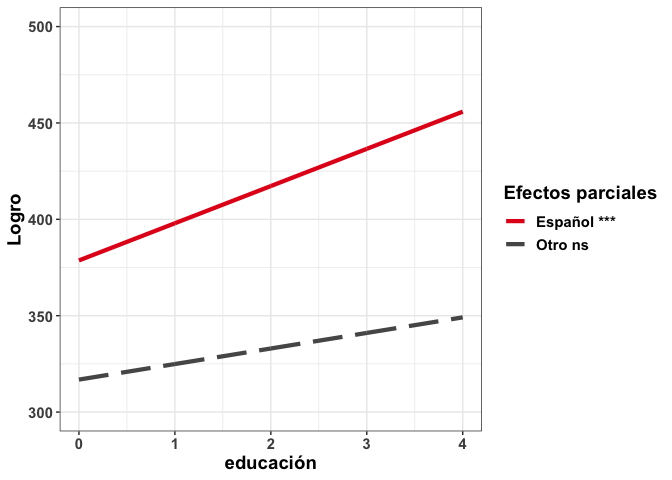

Introducción a Modelamiento de estudios de gran Escala
================
Daniel Miranda & Diego Carrasco\| Centro de Medición MIDE UC
Octubre 20, 2021

# Datos y variables

## Activar librerías

``` r
library(ggplot2)
# librería para generar graficos

library(dplyr)
# librería para manipular datos

library(haven)
# librería para abrir datos de diferentes fuentes (e.g., STATA, SPSS, SAS)

library(summarytools)
# librería para generar tablas de resumen

library(BIFIEsurvey)
# librería para realizar análisis con datos de gran escala
```

## Leer datos

``` r
# -----------------------------------------------------------------------------
# importar datos
# -----------------------------------------------------------------------------

# -----------------------------------------------
# carpeta relativa
# -----------------------------------------------

folder_within <- function(x){
paste0(tools::file_path_as_absolute(x),'/')
}

# Note: estas lineas asumen que la carpeta de datos "/data/", 
#       se encuentra en la misma carpeta en la que se 
#       encuentra el presente código.

data_folder    <- folder_within(paste0(getwd(),'/data/'))

# -----------------------------------------------
# abrir datos
# -----------------------------------------------

iccs <- haven::read_dta(paste0(data_folder, 'ICCS2016_colmee.dta'))

# Nota: la base de datos de ICCS 2016 solo incluye los datos de
#       Perú, para que el archivo de ejemplo sea más
#       facil de compartir.


# -----------------------------------------------
# inspeccionar datos
# -----------------------------------------------

# revisar clase de objeto
class(iccs)
```

    ## [1] "tbl_df"     "tbl"        "data.frame"

``` r
# revisar dimensiones (cantidad de columnas y filas)
dim(iccs)
```

    ## [1] 5166  352

``` r
# revisar la primera porción de la tabla de datos
head(iccs)
```

    ## # A tibble: 6 × 352
    ##     idcntry idstud idschool idclass   idpop totwgts jkzones jkreps idbid country
    ##   <dbl+lbl> <dbl+> <dbl+lb> <dbl+l> <dbl+l> <dbl+l> <dbl+l> <dbl+> <chr> <chr>  
    ## 1 604 [Per… 1.00e7     1001  100101 2 [Tar…    152.      52      1 IC3   PER    
    ## 2 604 [Per… 1.00e7     1001  100101 2 [Tar…    152.      52      1 IC3   PER    
    ## 3 604 [Per… 1.00e7     1001  100101 2 [Tar…    152.      52      1 IC3   PER    
    ## 4 604 [Per… 1.00e7     1001  100101 2 [Tar…    152.      52      1 IC3   PER    
    ## 5 604 [Per… 1.00e7     1001  100101 2 [Tar…    152.      52      1 IC3   PER    
    ## 6 604 [Per… 1.00e7     1001  100101 2 [Tar…    152.      52      1 IC3   PER    
    ## # … with 342 more variables: idgrade <dbl+lbl>, IS3G03 <dbl+lbl>,
    ## #   IS3G03BA <dbl+lbl>, IS3G03BB <dbl+lbl>, IS3G03BC <dbl+lbl>,
    ## #   IS3G03BD <dbl+lbl>, IS3G03BE <dbl+lbl>, IS3G03BF <dbl+lbl>,
    ## #   IS3G03BG <dbl+lbl>, IS3G04A <dbl+lbl>, IS3G04B <dbl+lbl>,
    ## #   IS3G04C <dbl+lbl>, IS3G05 <dbl+lbl>, IS3G07 <dbl+lbl>, IS3G09 <dbl+lbl>,
    ## #   IS3G10A <dbl+lbl>, IS3G10B <dbl+lbl>, IS3G10C <dbl+lbl>, IS3G11 <dbl+lbl>,
    ## #   IS3G12A <dbl+lbl>, IS3G12B <dbl+lbl>, IS3G12C <dbl+lbl>, …

``` r
# revisar estructura general
dplyr::glimpse(iccs)
```

    ## Rows: 5,166
    ## Columns: 352
    ## $ idcntry    <dbl+lbl> 604, 604, 604, 604, 604, 604, 604, 604, 604, 604, 604, …
    ## $ idstud     <dbl+lbl> 10010101, 10010102, 10010103, 10010104, 10010105, 10010…
    ## $ idschool   <dbl+lbl> 1001, 1001, 1001, 1001, 1001, 1001, 1001, 1001, 1001, 1…
    ## $ idclass    <dbl+lbl> 100101, 100101, 100101, 100101, 100101, 100101, 100101,…
    ## $ idpop      <dbl+lbl> 2, 2, 2, 2, 2, 2, 2, 2, 2, 2, 2, 2, 2, 2, 2, 2, 2, 2, 2…
    ## $ totwgts    <dbl+lbl> 152.359026, 152.359026, 152.359026, 152.359026, 152.359…
    ## $ jkzones    <dbl+lbl> 52, 52, 52, 52, 52, 52, 52, 52, 52, 52, 52, 52, 52, 52,…
    ## $ jkreps     <dbl+lbl> 1, 1, 1, 1, 1, 1, 1, 1, 1, 1, 1, 1, 1, 1, 1, 1, 0, 0, 0…
    ## $ idbid      <chr> "IC3", "IC3", "IC3", "IC3", "IC3", "IC3", "IC3", "IC3", "IC…
    ## $ country    <chr> "PER", "PER", "PER", "PER", "PER", "PER", "PER", "PER", "PE…
    ## $ idgrade    <dbl+lbl> 8, 8, 8, 8, 8, 8, 8, 8, 8, 8, 8, 8, 8, 8, 8, 8, 8, 8, 8…
    ## $ IS3G03     <dbl+lbl> 4, 1, 2, 1, 1, 2, 2, 2, 4, 2, 1, 2, 1, 1, 1, 1, 2, 1, 1…
    ## $ IS3G03BA   <dbl+lbl> 1, 1, 1, 1, 1, 1, 1, 1, 1, 1, 1, 1, 1, 1, 1, 1, 1, 1, 1…
    ## $ IS3G03BB   <dbl+lbl> 2, 2, 2, 2, 2, 1, 2, 2, 2, 2, 2, 2, 2, 2, 2, 2, 2, 2, 2…
    ## $ IS3G03BC   <dbl+lbl> 1, 2, 2, 1, 2, 1, 1, 1, 1, 1, 1, 1, 1, 1, 1, 1, 1, 1, 2…
    ## $ IS3G03BD   <dbl+lbl>  2,  2,  2,  2,  2,  1,  2,  2,  2, NA,  2,  2,  2,  2,…
    ## $ IS3G03BE   <dbl+lbl>  1,  2,  2,  1,  2,  1,  2,  2, NA, NA,  1,  1,  1,  2,…
    ## $ IS3G03BF   <dbl+lbl>  1,  2,  2, NA,  1,  1,  1,  1,  1, NA,  1, NA,  1,  2,…
    ## $ IS3G03BG   <dbl+lbl>  2,  2,  2,  2,  2,  1,  2,  2,  1, NA,  2, NA, NA,  2,…
    ## $ IS3G04A    <dbl+lbl>  0,  1,  1,  1,  1, NA, NA,  1,  1,  1,  1,  1,  1,  1,…
    ## $ IS3G04B    <dbl+lbl>  0,  1, NA, NA, NA, NA,  0,  0,  1,  1,  1,  1,  1,  1,…
    ## $ IS3G04C    <dbl+lbl> NA,  1, NA, NA, NA, NA,  0,  0,  1,  1,  1,  1,  1,  1,…
    ## $ IS3G05     <dbl+lbl>  1,  1,  1,  1,  1, NA,  1,  1,  1,  1,  1,  1,  1,  1,…
    ## $ IS3G07     <dbl+lbl> 5, 3, 5, 5, 3, 2, 3, 3, 3, 2, 3, 5, 5, 3, 5, 3, 5, 2, 2…
    ## $ IS3G09     <dbl+lbl> 1, 3, 3, 5, 1, 2, 2, 2, 3, 3, 5, 5, 3, 1, 1, 4, 5, 2, 1…
    ## $ IS3G10A    <dbl+lbl>  4,  2, NA,  2,  1,  1,  1,  4,  4,  1,  2,  2,  3,  4,…
    ## $ IS3G10B    <dbl+lbl>  4,  2, NA, NA,  2,  1,  1,  3, NA,  3,  1,  2,  2, NA,…
    ## $ IS3G10C    <dbl+lbl>  4,  2,  2, NA, NA,  1,  1,  2, NA,  2,  2,  2,  2,  2,…
    ## $ IS3G11     <dbl+lbl> 2, 2, 2, 4, 3, 5, 4, 3, 1, 2, 1, 5, 1, 2, 3, 2, 4, 2, 2…
    ## $ IS3G12A    <dbl+lbl> NA,  1, NA, NA,  2,  3,  4,  2,  4,  1,  1,  2,  1,  2,…
    ## $ IS3G12B    <dbl+lbl> NA,  1,  2, NA,  1,  2,  3,  1, NA,  2,  1,  1,  1,  1,…
    ## $ IS3G12C    <dbl+lbl>  3,  3, NA,  4,  4,  1,  4,  1, NA,  3,  1,  4,  2,  3,…
    ## $ IS3G13     <dbl+lbl> 2, 2, 2, 2, 1, 1, 2, 1, 2, 2, 2, 2, 1, 2, 2, 2, 1, 1, 1…
    ## $ IS3G14A    <dbl+lbl>  4,  1,  3, NA,  1,  1,  2,  4,  4,  4,  1,  4,  2,  4,…
    ## $ IS3G14B    <dbl+lbl>  2,  4, NA,  4,  4,  2,  4,  4,  3,  4,  4,  2,  1,  2,…
    ## $ IS3G14C    <dbl+lbl>  1,  1, NA, NA,  1,  2,  4,  3,  3,  4,  2,  4,  2,  1,…
    ## $ IS3G14D    <dbl+lbl>  1,  1, NA, NA,  1,  1,  2,  1,  3,  4,  1,  2,  1,  1,…
    ## $ IS3G14E    <dbl+lbl>  1,  1, NA, NA,  2,  2,  4,  1,  1,  4,  3,  4,  3,  2,…
    ## $ IS3G14F    <dbl+lbl>  1,  1, NA, NA,  1,  4,  3,  4,  1,  4,  4,  2,  2,  1,…
    ## $ IS3G14G    <dbl+lbl>  1,  1, NA, NA,  4,  4,  4,  2,  1,  4,  1,  2,  1,  2,…
    ## $ IS3G14H    <dbl+lbl>  1,  1, NA, NA,  4,  2,  3,  3,  1,  4,  1,  1,  1,  1,…
    ## $ IS3G14I    <dbl+lbl>  4,  1, NA, NA,  1,  1,  4,  1,  1,  4,  1,  1,  1,  1,…
    ## $ IS3G15A    <dbl+lbl>  1,  3, NA,  2,  3,  1,  3,  3,  3,  2,  3,  1,  2,  1,…
    ## $ IS3G15B    <dbl+lbl>  3,  3, NA,  1,  3,  1,  3,  3,  1,  1,  2,  1,  2,  2,…
    ## $ IS3G15C    <dbl+lbl>  1,  3,  1,  3,  3,  1,  2,  3,  1,  2,  3,  1,  3,  2,…
    ## $ IS3G15D    <dbl+lbl>  1,  3, NA,  3,  3,  2,  2,  1,  1,  3,  2,  1,  3,  3,…
    ## $ IS3G15E    <dbl+lbl>  3,  3, NA,  3,  3,  2,  3,  1,  1,  2,  3,  2,  3,  3,…
    ## $ IS3G15F    <dbl+lbl>  3,  3, NA,  2,  3,  1,  3,  1,  2, NA,  3,  1,  2,  2,…
    ## $ IS3G15G    <dbl+lbl>  2,  3, NA,  1,  3,  1,  2,  2,  1,  1,  2,  1,  3,  3,…
    ## $ IS3G15H    <dbl+lbl>  2,  1, NA,  1,  2,  1,  2,  3, NA,  2,  3,  1,  3,  3,…
    ## $ IS3G15I    <dbl+lbl>  3,  3, NA,  3,  3,  1,  3,  3, NA,  1,  3,  1,  3,  3,…
    ## $ IS3G15J    <dbl+lbl>  2,  3, NA,  1,  1,  1,  1,  2,  1,  2,  2,  1,  3,  1,…
    ## $ IS3G16A    <dbl+lbl>  2,  3, NA,  3,  3,  1,  3,  1,  1,  3,  3,  1,  3,  1,…
    ## $ IS3G16B    <dbl+lbl>  1,  1,  1,  2,  3,  2,  1,  3,  1,  3,  2,  1,  3,  1,…
    ## $ IS3G16C    <dbl+lbl>  1,  3, NA,  3,  3,  2,  1,  1,  1,  2,  2,  1,  3,  3,…
    ## $ IS3G16D    <dbl+lbl>  3,  3, NA,  1,  3,  1,  1,  1,  3,  2,  3,  2,  3,  3,…
    ## $ IS3G16E    <dbl+lbl>  2,  3, NA,  2,  3,  1,  1,  3,  3,  1,  3,  1,  3,  3,…
    ## $ IS3G16F    <dbl+lbl>  1,  3, NA,  1,  3,  1,  2,  2,  1,  2,  1,  1,  3,  1,…
    ## $ IS3G16G    <dbl+lbl>  1,  3, NA,  1,  3,  2,  1,  1,  1,  2,  1,  1,  1,  1,…
    ## $ IS3G17A    <dbl+lbl>  4,  3, NA,  4,  3, NA,  1,  1,  3,  1,  3,  2,  4,  4,…
    ## $ IS3G17B    <dbl+lbl>  4,  4,  4,  4,  3, NA,  2,  3,  3,  3,  4,  1,  4,  4,…
    ## $ IS3G17C    <dbl+lbl>  4,  1, NA,  3,  3, NA,  1,  4,  3,  3,  3,  4,  3,  1,…
    ## $ IS3G17D    <dbl+lbl>  4,  4, NA,  4,  3, NA,  4,  3,  3,  3,  3,  4,  4,  4,…
    ## $ IS3G17E    <dbl+lbl>  4,  1, NA,  1,  3, NA,  1,  2,  3,  3,  1,  1,  1,  4,…
    ## $ IS3G17F    <dbl+lbl>  4,  3, NA,  4,  3, NA,  2,  4,  3,  3,  3,  4,  3,  3,…
    ## $ IS3G18A    <dbl+lbl>  1,  4, NA,  1,  3, NA,  2,  2,  1,  1,  1,  1,  1,  3,…
    ## $ IS3G18B    <dbl+lbl>  1,  3,  1,  1,  3, NA,  1,  3,  1,  1,  1,  2,  2,  1,…
    ## $ IS3G18C    <dbl+lbl>  1,  3, NA,  1,  3, NA,  1,  4,  1,  1,  1,  4,  2,  3,…
    ## $ IS3G18D    <dbl+lbl>  2,  1, NA,  1,  3, NA,  4,  1,  1,  2,  3,  3,  2,  1,…
    ## $ IS3G18E    <dbl+lbl>  1,  1, NA,  2,  2, NA,  2,  3,  1,  4,  1,  3,  2,  1,…
    ## $ IS3G18F    <dbl+lbl>  2,  1, NA,  2,  2, NA,  3,  1,  4,  3,  3,  2,  2,  2,…
    ## $ IS3G18G    <dbl+lbl>  1,  1, NA,  1,  2, NA,  3,  2,  1,  1,  2,  3,  3,  3,…
    ## $ IS3G19A    <dbl+lbl>  2,  2, NA,  1,  4, NA,  1,  2,  4,  1,  1,  3,  1,  1,…
    ## $ IS3G19B    <dbl+lbl>  1,  1,  1,  1,  1, NA,  1,  1,  2,  2,  1,  2,  2,  1,…
    ## $ IS3G19C    <dbl+lbl>  1,  1, NA,  1,  1, NA,  1,  1,  2,  2,  2,  2,  1,  1,…
    ## $ IS3G19D    <dbl+lbl>  2,  1, NA,  1,  4, NA,  1,  4,  2,  2,  1,  2,  1,  1,…
    ## $ IS3G19E    <dbl+lbl>  1,  1, NA,  2,  2, NA,  1,  1,  2,  2,  2,  2,  1,  1,…
    ## $ IS3G19F    <dbl+lbl>  1,  2, NA,  1,  1, NA,  1,  2,  4,  2,  1,  2,  2,  1,…
    ## $ IS3G19G    <dbl+lbl>  1,  2, NA,  1,  1, NA,  2,  1,  2,  2,  1,  2,  2,  2,…
    ## $ IS3G19H    <dbl+lbl>  1,  2, NA,  1,  1, NA,  2,  1,  2,  2,  2,  2,  1,  2,…
    ## $ IS3G19I    <dbl+lbl>  1,  1, NA,  1,  1, NA,  1,  3,  2,  2,  1,  3,  2,  1,…
    ## $ IS3G19J    <dbl+lbl>  1,  1, NA,  4,  4, NA,  4,  2,  4,  2,  4,  2,  1,  4,…
    ## $ IS3G20A    <dbl+lbl>  2,  1,  2,  1,  2, NA,  1,  1,  1,  4,  4,  4,  4,  2,…
    ## $ IS3G20B    <dbl+lbl>  3,  1, NA,  1,  2, NA,  2,  2,  1,  1,  3,  2,  3,  1,…
    ## $ IS3G20C    <dbl+lbl>  1,  1, NA,  1,  2, NA,  1,  1,  1,  1,  1,  1,  1,  1,…
    ## $ IS3G20D    <dbl+lbl>  1,  1, NA,  1,  1, NA,  2,  1,  1,  2,  1,  1,  1,  1,…
    ## $ IS3G20E    <dbl+lbl>  1,  1, NA,  1,  1, NA,  1,  1,  1,  1,  1,  1,  1,  2,…
    ## $ IS3G20F    <dbl+lbl>  1,  1, NA,  1,  1, NA,  1,  1,  1,  1,  1,  1,  2,  2,…
    ## $ IS3G21A    <dbl+lbl>  1,  1,  1,  2,  1, NA,  1,  1,  2,  1,  1,  1,  2,  1,…
    ## $ IS3G21B    <dbl+lbl>  1,  1, NA,  1,  1, NA,  1,  2,  2,  1,  1,  2,  1,  2,…
    ## $ IS3G21C    <dbl+lbl>  2,  1, NA,  1,  1, NA,  2,  2,  2,  1,  1,  2,  1,  2,…
    ## $ IS3G21D    <dbl+lbl>  1,  1, NA,  1,  1, NA,  1,  3,  1,  1,  3,  2,  1,  4,…
    ## $ IS3G21E    <dbl+lbl>  3,  1, NA,  2,  2, NA,  1,  1,  2,  1,  2,  2,  3,  1,…
    ## $ IS3G22A    <dbl+lbl>  2,  3,  1, NA,  2,  1,  2,  1,  3,  3,  2,  1,  2,  1,…
    ## $ IS3G22B    <dbl+lbl>  3,  3, NA, NA,  2,  1,  2,  2,  3,  3,  3,  1,  3,  2,…
    ## $ IS3G22C    <dbl+lbl>  2,  2, NA, NA,  2,  2,  3,  1,  2,  1,  2,  1,  2,  1,…
    ## $ IS3G22D    <dbl+lbl>  1,  1, NA, NA,  2,  1,  1,  1,  2,  1,  1,  1,  1,  2,…
    ## $ IS3G22E    <dbl+lbl>  2,  2, NA, NA,  2,  2,  1,  2,  3,  3,  1,  1,  1,  3,…
    ## $ IS3G22F    <dbl+lbl>  1,  3, NA, NA,  2,  2,  2,  3,  2,  1,  2,  1,  2,  1,…
    ## $ IS3G22G    <dbl+lbl>  1,  1, NA, NA,  2,  2,  1,  1,  3,  2,  3,  3,  3,  2,…
    ## $ IS3G22H    <dbl+lbl>  1, NA, NA, NA,  2,  1,  2,  1,  2,  1,  2,  2,  2,  3,…
    ## $ IS3G22I    <dbl+lbl>  1,  1, NA,  1,  2,  2,  1,  2,  1,  1,  1,  1,  1,  2,…
    ## $ IS3G23A    <dbl+lbl>  1,  1,  1, NA,  1,  1,  1,  1,  2,  1,  1,  2,  1,  1,…
    ## $ IS3G23B    <dbl+lbl>  1,  1, NA, NA,  2,  1,  1,  2,  2,  2,  1,  2,  1,  3,…
    ## $ IS3G23C    <dbl+lbl>  1,  1, NA, NA,  1,  1,  1, NA,  2,  1,  1,  1,  1,  3,…
    ## $ IS3G23D    <dbl+lbl>  3,  1, NA, NA,  1,  1,  2,  3,  4,  1,  4,  2,  2,  3,…
    ## $ IS3G23E    <dbl+lbl>  1,  2, NA, NA,  1,  1,  1,  1,  2,  1,  2,  2,  1,  4,…
    ## $ IS3G23F    <dbl+lbl>  1,  4, NA, NA,  1,  1,  1,  4,  3,  1,  4,  2,  3,  4,…
    ## $ IS3G23G    <dbl+lbl>  1,  2, NA, NA,  1,  1,  1,  2,  2,  4,  2,  2,  3,  3,…
    ## $ IS3G23H    <dbl+lbl>  1,  1, NA, NA, NA,  1,  1,  1,  2,  1,  2,  2,  2,  3,…
    ## $ IS3G23I    <dbl+lbl>  1,  1, NA, NA,  3,  1,  1,  2,  2,  1,  1,  2,  1,  2,…
    ## $ IS3G23J    <dbl+lbl>  1,  1, NA,  1,  2,  1,  2,  3,  1,  1,  1,  2,  2,  2,…
    ## $ IS3G23K    <dbl+lbl>  2,  1, NA, NA,  1,  1,  1,  1,  4,  1,  3,  2,  1,  3,…
    ## $ IS3G23L    <dbl+lbl>  1,  1, NA, NA,  1,  1,  1,  1,  2,  1,  1,  2,  1,  3,…
    ## $ IS3G23M    <dbl+lbl>  1,  1, NA, NA,  1,  1,  1,  2,  2,  1,  1,  2,  1, NA,…
    ## $ IS3G23N    <dbl+lbl>  1,  1, NA, NA,  1,  1,  2,  3,  2,  1,  2,  2,  1,  1,…
    ## $ IS3G23O    <dbl+lbl>  1,  1, NA, NA,  1,  1,  1,  1,  2,  1,  1,  2,  1,  3,…
    ## $ IS3G23P    <dbl+lbl>  1,  1, NA, NA,  1,  1,  2,  2,  2,  1,  2,  2,  3,  2,…
    ## $ IS3G23Q    <dbl+lbl>  1,  1, NA, NA,  1,  1,  2,  4,  3,  1,  2,  2,  2,  3,…
    ## $ IS3G24A    <dbl+lbl>  1,  1, NA, NA,  1,  1,  1, NA,  2,  1,  1,  1,  1,  2,…
    ## $ IS3G24B    <dbl+lbl>  2,  1, NA,  1,  1,  1,  2, NA,  2,  1,  1,  1,  1,  1,…
    ## $ IS3G24C    <dbl+lbl>  1,  1, NA, NA,  3,  1,  1, NA,  2,  4,  4,  1,  4,  3,…
    ## $ IS3G24D    <dbl+lbl>  1,  4, NA, NA,  1,  1,  1, NA,  2,  1,  3,  1,  3,  2,…
    ## $ IS3G24E    <dbl+lbl>  1,  1, NA, NA,  2,  2,  1, NA,  2,  1,  1,  1,  2,  4,…
    ## $ IS3G24F    <dbl+lbl>  1,  4, NA, NA,  1,  2,  1, NA,  2,  1,  2,  1,  2,  4,…
    ## $ IS3G24G    <dbl+lbl>  1,  1,  4, NA,  1,  2,  4, NA,  2,  1,  4,  2,  4,  3,…
    ## $ IS3G25A    <dbl+lbl>  1,  1,  1, NA,  1,  1,  1, NA,  2,  1,  1,  2,  1,  1,…
    ## $ IS3G25B    <dbl+lbl>  2,  1, NA,  1,  1,  1,  1, NA,  2,  1,  1,  2,  1,  2,…
    ## $ IS3G25C    <dbl+lbl>  1,  1, NA, NA,  1,  1,  2, NA,  2,  1,  1,  2,  1,  3,…
    ## $ IS3G25D    <dbl+lbl>  1,  1,  4, NA,  1,  1,  1, NA,  2,  1,  3,  2,  1,  2,…
    ## $ IS3G25E    <dbl+lbl>  2,  1, NA, NA,  1,  1,  1, NA,  2,  1,  1,  2,  1,  2,…
    ## $ IS3G26A    <dbl+lbl>  2,  1,  1, NA,  1,  1,  1, NA,  4,  2,  1,  2,  2,  1,…
    ## $ IS3G26B    <dbl+lbl>  1,  1, NA,  1,  1,  1,  1, NA,  2,  1,  2,  2,  3,  3,…
    ## $ IS3G26C    <dbl+lbl>  1,  1, NA, NA,  1,  1,  1, NA,  3,  1,  1,  2,  3,  2,…
    ## $ IS3G26D    <dbl+lbl>  1,  1, NA, NA, NA,  1,  1, NA,  3,  1,  2,  2,  3,  1,…
    ## $ IS3G26E    <dbl+lbl>  1,  1, NA, NA,  2,  1,  4, NA,  3,  1,  3,  2,  2,  4,…
    ## $ IS3G26F    <dbl+lbl>  1,  1, NA, NA,  3,  1,  2, NA,  3,  1,  3,  2,  3,  3,…
    ## $ IS3G26G    <dbl+lbl>  1,  1, NA, NA,  3,  1,  2, NA,  2,  1,  2,  3,  3,  2,…
    ## $ IS3G26H    <dbl+lbl>  1,  4, NA, NA,  1,  2,  2, NA,  3,  1,  4,  4,  2,  4,…
    ## $ IS3G26I    <dbl+lbl>  1,  4, NA, NA,  2,  2,  1, NA,  2,  1,  2,  2,  1,  1,…
    ## $ IS3G26J    <dbl+lbl>  1,  1, NA, NA,  1,  1,  1, NA,  2,  1,  4,  1,  1,  4,…
    ## $ IS3G26K    <dbl+lbl>  1,  1, NA, NA,  2,  1,  1, NA,  2,  1,  1,  1,  1,  1,…
    ## $ IS3G26L    <dbl+lbl>  1,  1, NA, NA,  2,  1,  1, NA,  2,  1,  2,  1,  2,  3,…
    ## $ IS3G26M    <dbl+lbl>  1,  1, NA, NA,  3,  1,  1, NA,  4,  1,  1,  3,  2,  3,…
    ## $ IS3G26N    <dbl+lbl> NA, NA, NA, NA, NA, NA, NA, NA, NA, NA, NA, NA, NA, NA,…
    ## $ IS3G26O    <dbl+lbl> NA, NA, NA, NA, NA, NA, NA, NA, NA, NA, NA, NA, NA, NA,…
    ## $ IS3G27A    <dbl+lbl>  1,  1,  1, NA,  1,  1,  1, NA,  1,  1,  1,  2,  1,  1,…
    ## $ IS3G27B    <dbl+lbl>  1,  1,  2, NA,  2,  1,  1, NA,  1,  1,  1,  2,  1,  1,…
    ## $ IS3G27C    <dbl+lbl>  1,  1, NA, NA,  2,  1,  1, NA,  1,  1,  1,  2,  1,  2,…
    ## $ IS3G27D    <dbl+lbl>  1,  1, NA,  1,  2,  1,  1, NA,  1,  1,  1,  3,  1,  3,…
    ## $ IS3G27E    <dbl+lbl>  1,  1, NA, NA,  1,  1,  2, NA,  1,  1,  2,  3,  1,  3,…
    ## $ IS3G28A    <dbl+lbl> 1, 1, 2, 1, 1, 1, 1, 1, 1, 1, 1, 1, 1, 4, 1, 1, 1, 2, 1…
    ## $ IS3G28B    <dbl+lbl>  1,  1,  4,  3,  2,  2,  1, NA,  1,  1,  2,  3,  4,  2,…
    ## $ IS3G28C    <dbl+lbl> 2, 1, 3, 2, 1, 4, 2, 4, 1, 1, 3, 1, 3, 1, 2, 1, 1, 2, 2…
    ## $ IS3G28D    <dbl+lbl> 1, 1, 1, 2, 2, 4, 1, 2, 1, 4, 1, 1, 1, 3, 2, 1, 1, 1, 2…
    ## $ IS3G28E    <dbl+lbl>  3,  1,  4,  1,  1,  4,  1,  2,  4,  2,  2,  1,  4,  2,…
    ## $ IS3G28F    <dbl+lbl> 2, 1, 3, 3, 2, 4, 1, 1, 1, 2, 1, 1, 1, 3, 1, 2, 1, 3, 1…
    ## $ IS3G28G    <dbl+lbl>  1,  3,  3,  2,  1,  4,  2, NA,  1,  2,  1,  1,  1,  1,…
    ## $ IS3G28H    <dbl+lbl>  3,  1,  3,  3,  2,  4,  3, NA,  1,  2,  2,  2,  1,  2,…
    ## $ IS3G28I    <dbl+lbl>  2,  1,  4,  3,  1,  4,  1, NA,  1,  2,  1,  1,  1,  2,…
    ## $ IS3G28J    <dbl+lbl>  3,  3,  3,  2,  2,  4,  1, NA,  1,  4,  1,  1,  1,  4,…
    ## $ IS3G28K    <dbl+lbl>  1,  3,  2,  2,  2,  4,  1, NA,  1,  2,  3,  1,  1,  2,…
    ## $ IS3G28L    <dbl+lbl>  2,  2,  4,  2,  1,  4,  1, NA,  1,  2,  1,  2,  1,  1,…
    ## $ IS3G28M    <dbl+lbl>  3,  3,  4,  4,  2,  4,  1, NA,  1,  4,  1,  1,  1,  3,…
    ## $ IS3G29A    <dbl+lbl> 1, 3, 4, 1, 1, 1, 2, 1, 2, 4, 1, 4, 2, 1, 3, 3, 2, 2, 2…
    ## $ IS3G29B    <dbl+lbl>  2,  1, NA,  4,  2,  1,  1,  2,  2,  1,  1,  3,  2,  2,…
    ## $ IS3G29C    <dbl+lbl>  1,  1, NA,  1,  1,  1,  1,  1,  1,  1,  2,  3,  2,  3,…
    ## $ IS3G29D    <dbl+lbl>  1,  1, NA,  1,  1,  1,  1,  2,  1,  1,  1,  3,  1,  3,…
    ## $ IS3G29E    <dbl+lbl>  2,  3, NA,  4,  2,  1,  2,  1,  1,  1,  1,  3,  3,  2,…
    ## $ IS3G29F    <dbl+lbl>  3,  1, NA,  2,  1,  1,  3,  3,  2,  1,  4,  2,  1,  3,…
    ## $ IS3G29G    <dbl+lbl>  1,  2, NA,  2,  2,  1,  1,  1,  2,  1,  3,  2,  1,  2,…
    ## $ IS3G30A    <dbl+lbl>  1,  4, NA,  1,  1, NA,  4,  1,  2,  1,  1,  3,  1,  1,…
    ## $ IS3G30B    <dbl+lbl>  2,  1, NA,  1,  2, NA,  2,  2,  2,  1,  2,  3,  3,  2,…
    ## $ IS3G30C    <dbl+lbl>  1,  2, NA,  4,  3, NA,  3,  3,  2,  1,  1,  3,  1,  3,…
    ## $ IS3G30D    <dbl+lbl>  1,  1, NA,  1,  1,  1,  3,  4,  2,  1,  3,  3,  3,  4,…
    ## $ IS3G30E    <dbl+lbl>  1,  1, NA,  4,  1, NA,  3,  1,  2,  1,  2,  3,  3,  3,…
    ## $ IS3G30F    <dbl+lbl>  1,  2, NA,  1,  1, NA,  2,  2,  2,  1,  1,  3,  1,  2,…
    ## $ IS3G30G    <dbl+lbl>  1, NA, NA,  1,  1, NA,  2,  1,  2,  1,  4,  3,  1,  1,…
    ## $ IS3G30H    <dbl+lbl>  1,  1, NA,  1,  1, NA,  2,  2,  2,  1,  4,  2,  1,  1,…
    ## $ IS3G30I    <dbl+lbl>  1,  2, NA,  4,  1,  4,  3,  3,  2,  4,  4,  2,  2,  2,…
    ## $ IS3G30J    <dbl+lbl>  1,  1, NA,  4,  1, NA,  2,  1,  2,  4,  3,  2,  1,  3,…
    ## $ IS3G30K    <dbl+lbl>  1,  1, NA,  4,  1,  4,  2,  2,  2,  4,  3,  3,  2,  4,…
    ## $ IS3G31A    <dbl+lbl>  2,  1, NA, NA,  1,  2,  1,  1,  2,  1,  1,  1,  2,  4,…
    ## $ IS3G31B    <dbl+lbl>  2,  1, NA, NA,  1, NA,  1,  2,  2,  1,  3,  2,  2,  3,…
    ## $ IS3G31C    <dbl+lbl>  2,  2, NA, NA,  1, NA,  2,  1,  2,  1,  1,  2,  1,  2,…
    ## $ IS3G31D    <dbl+lbl>  2,  1, NA, NA,  2, NA,  2,  3,  2,  1,  1,  2,  1,  1,…
    ## $ IS3G31E    <dbl+lbl>  2,  2, NA, NA,  2, NA,  1,  4,  2,  1,  2,  2,  1,  2,…
    ## $ IS3G31F    <dbl+lbl>  1,  1, NA, NA,  3, NA,  1,  1,  2,  1,  1,  2,  2,  3,…
    ## $ IS3G31G    <dbl+lbl>  1,  1, NA, NA,  1, NA,  4,  2,  2,  1,  2,  3,  1,  4,…
    ## $ IS3G31H    <dbl+lbl>  1,  1, NA, NA,  2, NA,  3,  3,  2,  2,  1,  3,  1,  3,…
    ## $ IS3G31I    <dbl+lbl>  1,  1, NA, NA,  2, NA,  3,  1,  2,  1,  1,  3,  1,  2,…
    ## $ IS3G31J    <dbl+lbl>  2,  1, NA, NA,  1, NA,  2,  3,  2,  1,  2,  3,  1,  1,…
    ## $ IS3G31K    <dbl+lbl>  1,  1, NA, NA,  2, NA,  2,  1,  2,  1,  3,  3,  1,  2,…
    ## $ IS3G31L    <dbl+lbl> NA, NA, NA, NA, NA, NA, NA, NA, NA, NA, NA, NA, NA, NA,…
    ## $ IS3G32A    <dbl+lbl>  2,  1, NA, NA,  1,  1,  1,  1,  1,  1,  1,  1,  1,  2,…
    ## $ IS3G32B    <dbl+lbl>  1,  2, NA, NA,  2, NA,  2,  1,  1,  1,  2,  1,  1,  1,…
    ## $ IS3G32C    <dbl+lbl>  2,  1, NA, NA,  1, NA,  1,  2,  1,  1,  1,  1,  1,  2,…
    ## $ IS3G32D    <dbl+lbl>  1,  1, NA, NA,  2, NA,  1,  2,  1,  1,  2, NA,  4,  3,…
    ## $ IS3G32E    <dbl+lbl>  3,  1, NA, NA,  1, NA,  1,  3,  1,  1,  4,  1,  3,  4,…
    ## $ IS3G33     <dbl+lbl>  1,  1, NA, NA, NA,  1,  0,  1,  1,  1,  1,  1,  1,  1,…
    ## $ IS3G34     <dbl+lbl>  3,  5, NA, NA,  1,  2,  5,  1,  1,  1,  2,  4,  3,  4,…
    ## $ IS3G35A    <dbl+lbl>  1,  1, NA, NA,  1, NA,  1,  1,  1,  1,  3,  1,  3,  4,…
    ## $ IS3G35B    <dbl+lbl>  3,  2, NA, NA,  1,  1,  1,  2,  4,  1,  1,  1,  1,  3,…
    ## $ IS3G35C    <dbl+lbl>  1,  1, NA, NA,  2, NA,  1,  3,  1,  1,  2,  1,  2,  3,…
    ## $ IS3G35D    <dbl+lbl>  1,  2, NA, NA,  1, NA,  2,  4,  1,  1,  1,  3,  1,  2,…
    ## $ IS3G35E    <dbl+lbl>  2,  1, NA, NA,  3, NA,  2,  1,  1,  2,  3,  1,  3,  2,…
    ## $ IS3G35F    <dbl+lbl>  1,  1, NA, NA,  3, NA,  2,  2,  1,  1,  1,  1,  1,  3,…
    ## $ IS3G35G    <dbl+lbl>  2,  2, NA, NA,  1, NA,  2,  1,  1,  1,  2,  2,  3,  2,…
    ## $ IS3G02BN   <dbl+lbl> 60401, 60401, 60404, 60403, 60401, 60404, 60404, 60403,…
    ## $ IS3G04AN   <dbl+lbl> 60404, 60401, 60401, 60401, 60401,    NA,    NA, 60401,…
    ## $ IS3G04BN   <dbl+lbl> 60402, 60401,    NA,    NA,    NA,    NA, 60402, 60402,…
    ## $ IS3G04CN   <dbl+lbl>    NA, 60401,    NA,    NA,    NA,    NA, 60403, 60403,…
    ## $ IS3G05N    <dbl+lbl> 60401, 60401, 60401, 60401, 60401,    NA, 60401, 60401,…
    ## $ IS3G33N    <dbl+lbl> 60403, 60403,    NA,    NA,    NA, 60403, 60401, 60403,…
    ## $ idbook     <dbl+lbl> 6, 7, 8, 1, 2, 3, 4, 5, 6, 7, 8, 1, 2, 3, 4, 5, 4, 5, 6…
    ## $ itadmini   <dbl+lbl> 3, 3, 3, 3, 3, 3, 3, 3, 3, 3, 3, 3, 3, 3, 3, 3, 3, 3, 3…
    ## $ itlang     <dbl+lbl> 2, 2, 2, 2, 2, 2, 2, 2, 2, 2, 2, 2, 2, 2, 2, 2, 2, 2, 2…
    ## $ ilreliab   <dbl+lbl> 0, 0, 0, 1, 0, 0, 0, 1, 0, 0, 0, 0, 0, 0, 0, 0, 0, 0, 0…
    ## $ stream     <dbl+lbl> NA, NA, NA, NA, NA, NA, NA, NA, NA, NA, NA, NA, NA, NA,…
    ## $ S_AGE      <dbl+lbl> 13.67, 13.58, 13.83, 13.33, 13.92, 13.83, 13.33, 13.25,…
    ## $ S_FINT     <dbl+lbl>  0,  2,  2, NA, NA,  3,  3,  2, NA,  2,  2,  2,  2,  2,…
    ## $ S_FISCED   <dbl+lbl> 4, 2, 2, 0, 4, 3, 3, 3, 2, 2, 0, 0, 2, 4, 4, 1, 0, 3, 4…
    ## $ S_FISCO    <chr> "7111", "8111", "7111", "6310", "9705", "9705", "9211", "99…
    ## $ S_FISEI    <dbl+lbl> 40, 40, 40, 10, NA, NA, 16, NA, 24, 16, 10, 38, 10, 71,…
    ## $ S_GENDER   <dbl+lbl> 1, 1, 1, 0, 0, 0, 1, 1, 0, 0, 0, 1, 0, 0, 1, 1, 0, 1, 1…
    ## $ S_HINT     <dbl+lbl>  0,  2,  2, NA,  2,  3,  3,  2, NA,  2,  3,  2,  2,  2,…
    ## $ S_HISCED   <dbl+lbl> 4, 2, 2, 0, 4, 3, 3, 3, 2, 3, 2, 0, 2, 4, 4, 2, 0, 3, 4…
    ## $ S_HISEI    <dbl+lbl> 40, 40, 40, 20, 23, NA, 31, NA, 24, 27, 16, 38, 10, 71,…
    ## $ S_HOMLIT   <dbl+lbl> 1, 1, 1, 3, 2, 4, 3, 2, 0, 1, 0, 4, 0, 1, 2, 1, 3, 1, 1…
    ## $ S_IMMIG    <dbl+lbl>  3,  1, NA, NA, NA, NA, NA,  2,  1,  1,  1,  1,  1,  1,…
    ## $ S_ISCED    <dbl+lbl> 0, 3, 2, 3, 3, 2, 2, 2, 0, 2, 3, 2, 3, 3, 3, 3, 2, 3, 3…
    ## $ S_MINT     <dbl+lbl>  0,  2, NA, NA,  2,  3,  3,  1, NA,  1,  3,  2,  2, NA,…
    ## $ S_MISCED   <dbl+lbl> 0, 2, 0, 0, 2, 3, 2, 2, 2, 3, 2, 0, 0, 2, 0, 2, 0, 3, 3…
    ## $ S_MISCO    <chr> "9412", "6121", "5223", "9212", "6121", "9701", "5211", "99…
    ## $ S_MISEI    <dbl+lbl> 10, 23, 31, 20, 23, NA, 31, NA, NA, 27, 16, 27, 10, 10,…
    ## $ S_RELIG    <dbl+lbl>  1,  1, NA, NA, NA,  1,  0,  1,  1,  1,  1,  1,  1,  1,…
    ## $ S_RELSER   <dbl+lbl>  2,  4, NA, NA,  0,  1,  4,  0,  0,  0,  1,  3,  2,  3,…
    ## $ S_SINT     <dbl+lbl>  0,  2, NA,  2,  3,  3,  3,  0,  0,  3,  2,  2,  1,  0,…
    ## $ S_TLANG    <dbl+lbl>  1,  1,  1,  1,  1, NA,  1,  1,  1,  1,  1,  1,  1,  1,…
    ## $ S_ABUSE    <dbl+lbl> 53.55, 37.04,    NA, 37.04, 53.55,    NA, 50.42, 46.04,…
    ## $ S_CNTATT   <dbl+lbl> 64.53, 64.53, 49.52,    NA, 49.60, 64.53, 57.12,    NA,…
    ## $ S_CITCON   <dbl+lbl> 65.99, 58.75,    NA,    NA, 71.08, 80.81, 71.08, 50.25,…
    ## $ S_CITEFF   <dbl+lbl> 60.95, 58.69,    NA, 52.65, 63.48, 78.42, 60.95, 60.95,…
    ## $ S_CITRESP  <dbl+lbl> 60.13, 69.02,    NA,    NA, 69.02, 69.02, 51.82, 41.45,…
    ## $ S_CITSOC   <dbl+lbl> 66.98, 59.44,    NA,    NA, 47.96, 66.98, 59.44, 47.78,…
    ## $ S_CIVLRN   <dbl+lbl> 65.21, 52.58,    NA, 65.21, 45.41,    NA, 48.90, 48.90,…
    ## $ S_ELECPART <dbl+lbl> 46.74, 55.43,    NA,    NA, 61.51,    NA, 55.43, 55.43,…
    ## $ S_ETHRGHT  <dbl+lbl> 54.09, 66.36, 38.49,    NA, 66.36, 66.36, 58.62,    NA,…
    ## $ S_GENEQL   <dbl+lbl> 36.67, 48.72,    NA,    NA, 39.57, 38.12, 36.67,    NA,…
    ## $ S_ILLACT   <dbl+lbl> 74.12, 68.91,    NA, 39.15, 74.12, 40.41, 60.81, 63.34,…
    ## $ S_INTACT   <dbl+lbl> 68.18, 56.63,    NA, 68.18, 68.18,    NA, 56.63, 56.63,…
    ## $ S_INTRUST  <dbl+lbl> 69.01, 75.73,    NA,    NA, 61.49, 75.73, 59.51,    NA,…
    ## $ S_LEGACT   <dbl+lbl> 70.55, 58.62,    NA, 58.44, 64.41,    NA, 47.52, 56.66,…
    ## $ S_OPDISC   <dbl+lbl> 78.16, 46.53,    NA, 55.84, 50.75,    NA, 37.13, 48.57,…
    ## $ S_POLDISC  <dbl+lbl> 51.24, 34.77,    NA,    NA, 43.25, 54.00, 60.81, 58.64,…
    ## $ S_POLPART  <dbl+lbl> 66.40, 69.40,    NA,    NA, 60.38,    NA, 58.55, 54.50,…
    ## $ S_COMPART  <dbl+lbl> 63.63, 38.11,    NA, 61.69, 38.11, 74.60, 54.87, 63.63,…
    ## $ S_SCHPART  <dbl+lbl> 59.25, 42.98,    NA, 54.46, 28.96, 65.07, 61.91, 56.82,…
    ## $ S_RELINF   <dbl+lbl> 60.12, 62.03,    NA,    NA, 62.03,    NA, 62.03, 56.69,…
    ## $ S_SCACT    <dbl+lbl> 55.05, 63.91,    NA,    NA, 60.19,    NA, 63.91, 55.05,…
    ## $ S_SOCMED   <dbl+lbl> 58.75, 38.90,    NA,    NA, 67.16, 61.89, 73.89, 58.75,…
    ## $ S_STUTREL  <dbl+lbl> 60.36, 64.54,    NA, 64.54, 42.41,    NA, 71.68, 53.24,…
    ## $ S_VALPARTS <dbl+lbl> 53.75, 68.37,    NA, 57.27, 61.36,    NA, 61.36, 50.05,…
    ## $ S_NISB     <dbl+lbl>  0.52, -0.31, -0.31, -0.49,  0.46,  0.96,  0.63,  0.75,…
    ## $ PV1CIV     <dbl+lbl> 327.40, 307.00, 329.32, 373.51, 276.23, 277.66, 299.47,…
    ## $ PV2CIV     <dbl+lbl> 249.59, 338.74, 248.56, 465.57, 294.25, 185.67, 329.57,…
    ## $ PV3CIV     <dbl+lbl> 234.02, 385.85, 307.88, 462.79, 381.65, 206.78, 308.30,…
    ## $ PV4CIV     <dbl+lbl> 278.90, 310.84, 237.25, 411.11, 331.36, 222.20, 310.78,…
    ## $ PV5CIV     <dbl+lbl> 231.34, 332.57, 230.29, 384.60, 308.53, 234.40, 365.93,…
    ## $ INICS16    <dbl+lbl> 1, 1, 1, 1, 1, 1, 1, 1, 1, 1, 1, 1, 1, 1, 1, 1, 1, 1, 1…
    ## $ WGTFAC1    <dbl+lbl> 76.179513, 76.179513, 76.179513, 76.179513, 76.179513, …
    ## $ WGTADJ1S   <dbl+lbl> 1, 1, 1, 1, 1, 1, 1, 1, 1, 1, 1, 1, 1, 1, 1, 1, 1, 1, 1…
    ## $ WGTFAC2S   <dbl+lbl> 2, 2, 2, 2, 2, 2, 2, 2, 2, 2, 2, 2, 2, 2, 2, 2, 3, 3, 3…
    ## $ WGTADJ2S   <dbl+lbl> 1, 1, 1, 1, 1, 1, 1, 1, 1, 1, 1, 1, 1, 1, 1, 1, 1, 1, 1…
    ## $ WGTADJ3S   <dbl+lbl> 1, 1, 1, 1, 1, 1, 1, 1, 1, 1, 1, 1, 1, 1, 1, 1, 1, 1, 1…
    ## $ SRWGT1     <dbl+lbl> 152.359026, 152.359026, 152.359026, 152.359026, 152.359…
    ## $ SRWGT2     <dbl+lbl> 152.359026, 152.359026, 152.359026, 152.359026, 152.359…
    ## $ SRWGT3     <dbl+lbl> 152.359026, 152.359026, 152.359026, 152.359026, 152.359…
    ## $ SRWGT4     <dbl+lbl> 152.359026, 152.359026, 152.359026, 152.359026, 152.359…
    ## $ SRWGT5     <dbl+lbl> 152.359026, 152.359026, 152.359026, 152.359026, 152.359…
    ## $ SRWGT6     <dbl+lbl> 152.359026, 152.359026, 152.359026, 152.359026, 152.359…
    ## $ SRWGT7     <dbl+lbl> 152.359026, 152.359026, 152.359026, 152.359026, 152.359…
    ## $ SRWGT8     <dbl+lbl> 152.359026, 152.359026, 152.359026, 152.359026, 152.359…
    ## $ SRWGT9     <dbl+lbl> 152.359026, 152.359026, 152.359026, 152.359026, 152.359…
    ## $ SRWGT10    <dbl+lbl> 152.359026, 152.359026, 152.359026, 152.359026, 152.359…
    ## $ SRWGT11    <dbl+lbl> 152.359026, 152.359026, 152.359026, 152.359026, 152.359…
    ## $ SRWGT12    <dbl+lbl> 152.359026, 152.359026, 152.359026, 152.359026, 152.359…
    ## $ SRWGT13    <dbl+lbl> 152.359026, 152.359026, 152.359026, 152.359026, 152.359…
    ## $ SRWGT14    <dbl+lbl> 152.359026, 152.359026, 152.359026, 152.359026, 152.359…
    ## $ SRWGT15    <dbl+lbl> 152.359026, 152.359026, 152.359026, 152.359026, 152.359…
    ## $ SRWGT16    <dbl+lbl> 152.359026, 152.359026, 152.359026, 152.359026, 152.359…
    ## $ SRWGT17    <dbl+lbl> 152.359026, 152.359026, 152.359026, 152.359026, 152.359…
    ## $ SRWGT18    <dbl+lbl> 152.359026, 152.359026, 152.359026, 152.359026, 152.359…
    ## $ SRWGT19    <dbl+lbl> 152.359026, 152.359026, 152.359026, 152.359026, 152.359…
    ## $ SRWGT20    <dbl+lbl> 152.359026, 152.359026, 152.359026, 152.359026, 152.359…
    ## $ SRWGT21    <dbl+lbl> 152.359026, 152.359026, 152.359026, 152.359026, 152.359…
    ## $ SRWGT22    <dbl+lbl> 152.359026, 152.359026, 152.359026, 152.359026, 152.359…
    ## $ SRWGT23    <dbl+lbl> 152.359026, 152.359026, 152.359026, 152.359026, 152.359…
    ## $ SRWGT24    <dbl+lbl> 152.359026, 152.359026, 152.359026, 152.359026, 152.359…
    ## $ SRWGT25    <dbl+lbl> 152.359026, 152.359026, 152.359026, 152.359026, 152.359…
    ## $ SRWGT26    <dbl+lbl> 152.359026, 152.359026, 152.359026, 152.359026, 152.359…
    ## $ SRWGT27    <dbl+lbl> 152.359026, 152.359026, 152.359026, 152.359026, 152.359…
    ## $ SRWGT28    <dbl+lbl> 152.359026, 152.359026, 152.359026, 152.359026, 152.359…
    ## $ SRWGT29    <dbl+lbl> 152.359026, 152.359026, 152.359026, 152.359026, 152.359…
    ## $ SRWGT30    <dbl+lbl> 152.359026, 152.359026, 152.359026, 152.359026, 152.359…
    ## $ SRWGT31    <dbl+lbl> 152.359026, 152.359026, 152.359026, 152.359026, 152.359…
    ## $ SRWGT32    <dbl+lbl> 152.359026, 152.359026, 152.359026, 152.359026, 152.359…
    ## $ SRWGT33    <dbl+lbl> 152.359026, 152.359026, 152.359026, 152.359026, 152.359…
    ## $ SRWGT34    <dbl+lbl> 152.359026, 152.359026, 152.359026, 152.359026, 152.359…
    ## $ SRWGT35    <dbl+lbl> 152.359026, 152.359026, 152.359026, 152.359026, 152.359…
    ## $ SRWGT36    <dbl+lbl> 152.359026, 152.359026, 152.359026, 152.359026, 152.359…
    ## $ SRWGT37    <dbl+lbl> 152.359026, 152.359026, 152.359026, 152.359026, 152.359…
    ## $ SRWGT38    <dbl+lbl> 152.359026, 152.359026, 152.359026, 152.359026, 152.359…
    ## $ SRWGT39    <dbl+lbl> 152.359026, 152.359026, 152.359026, 152.359026, 152.359…
    ## $ SRWGT40    <dbl+lbl> 152.359026, 152.359026, 152.359026, 152.359026, 152.359…
    ## $ SRWGT41    <dbl+lbl> 152.359026, 152.359026, 152.359026, 152.359026, 152.359…
    ## $ SRWGT42    <dbl+lbl> 152.359026, 152.359026, 152.359026, 152.359026, 152.359…
    ## $ SRWGT43    <dbl+lbl> 152.359026, 152.359026, 152.359026, 152.359026, 152.359…
    ## $ SRWGT44    <dbl+lbl> 152.359026, 152.359026, 152.359026, 152.359026, 152.359…
    ## $ SRWGT45    <dbl+lbl> 152.359026, 152.359026, 152.359026, 152.359026, 152.359…
    ## $ SRWGT46    <dbl+lbl> 152.359026, 152.359026, 152.359026, 152.359026, 152.359…
    ## $ SRWGT47    <dbl+lbl> 152.359026, 152.359026, 152.359026, 152.359026, 152.359…
    ## $ SRWGT48    <dbl+lbl> 152.359026, 152.359026, 152.359026, 152.359026, 152.359…
    ## $ SRWGT49    <dbl+lbl> 152.359026, 152.359026, 152.359026, 152.359026, 152.359…
    ## $ SRWGT50    <dbl+lbl> 152.359026, 152.359026, 152.359026, 152.359026, 152.359…
    ## $ SRWGT51    <dbl+lbl> 152.359026, 152.359026, 152.359026, 152.359026, 152.359…
    ## $ SRWGT52    <dbl+lbl> 152.359026, 152.359026, 152.359026, 152.359026, 152.359…
    ## $ SRWGT53    <dbl+lbl> 152.359026, 152.359026, 152.359026, 152.359026, 152.359…
    ## $ SRWGT54    <dbl+lbl> 152.359026, 152.359026, 152.359026, 152.359026, 152.359…
    ## $ SRWGT55    <dbl+lbl> 152.359026, 152.359026, 152.359026, 152.359026, 152.359…
    ## $ SRWGT56    <dbl+lbl> 152.359026, 152.359026, 152.359026, 152.359026, 152.359…
    ## $ SRWGT57    <dbl+lbl> 152.359026, 152.359026, 152.359026, 152.359026, 152.359…
    ## $ SRWGT58    <dbl+lbl> 152.359026, 152.359026, 152.359026, 152.359026, 152.359…
    ## $ SRWGT59    <dbl+lbl> 152.359026, 152.359026, 152.359026, 152.359026, 152.359…
    ## $ SRWGT60    <dbl+lbl> 152.359026, 152.359026, 152.359026, 152.359026, 152.359…
    ## $ SRWGT61    <dbl+lbl> 152.359026, 152.359026, 152.359026, 152.359026, 152.359…
    ## $ SRWGT62    <dbl+lbl> 152.359026, 152.359026, 152.359026, 152.359026, 152.359…
    ## $ SRWGT63    <dbl+lbl> 152.359026, 152.359026, 152.359026, 152.359026, 152.359…
    ## $ SRWGT64    <dbl+lbl> 152.359026, 152.359026, 152.359026, 152.359026, 152.359…
    ## $ SRWGT65    <dbl+lbl> 152.359026, 152.359026, 152.359026, 152.359026, 152.359…
    ## $ SRWGT66    <dbl+lbl> 152.359026, 152.359026, 152.359026, 152.359026, 152.359…
    ## $ SRWGT67    <dbl+lbl> 152.359026, 152.359026, 152.359026, 152.359026, 152.359…
    ## $ SRWGT68    <dbl+lbl> 152.359026, 152.359026, 152.359026, 152.359026, 152.359…
    ## $ SRWGT69    <dbl+lbl> 304.718052, 304.718052, 304.718052, 304.718052, 304.718…
    ## $ SRWGT70    <dbl+lbl> 152.359026, 152.359026, 152.359026, 152.359026, 152.359…
    ## $ SRWGT71    <dbl+lbl> 152.359026, 152.359026, 152.359026, 152.359026, 152.359…
    ## $ SRWGT72    <dbl+lbl> 152.359026, 152.359026, 152.359026, 152.359026, 152.359…
    ## $ SRWGT73    <dbl+lbl> 152.359026, 152.359026, 152.359026, 152.359026, 152.359…
    ## $ SRWGT74    <dbl+lbl> 152.359026, 152.359026, 152.359026, 152.359026, 152.359…
    ## $ SRWGT75    <dbl+lbl> 152.359026, 152.359026, 152.359026, 152.359026, 152.359…
    ## $ version    <dbl+lbl> 32, 32, 32, 32, 32, 32, 32, 32, 32, 32, 32, 32, 32, 32,…
    ## $ scope      <dbl+lbl> 3, 3, 3, 3, 3, 3, 3, 3, 3, 3, 3, 3, 3, 3, 3, 3, 3, 3, 3…

## Seleccionar datos de un País de interés

``` r
# -----------------------------------------------
# filtrar datos
# -----------------------------------------------

iccsp <- iccs %>%
         dplyr::filter(country == "PER")

# Nota: la base de cargada en sesión, solo tiene los datos de Perú
#       de ICCS 2016.

# -----------------------------------------------
# inspeccionar datos
# -----------------------------------------------

class(iccsp)
```

    ## [1] "tbl_df"     "tbl"        "data.frame"

``` r
dim(iccsp)
```

    ## [1] 5166  352

``` r
head(iccsp)
```

    ## # A tibble: 6 × 352
    ##     idcntry idstud idschool idclass   idpop totwgts jkzones jkreps idbid country
    ##   <dbl+lbl> <dbl+> <dbl+lb> <dbl+l> <dbl+l> <dbl+l> <dbl+l> <dbl+> <chr> <chr>  
    ## 1 604 [Per… 1.00e7     1001  100101 2 [Tar…    152.      52      1 IC3   PER    
    ## 2 604 [Per… 1.00e7     1001  100101 2 [Tar…    152.      52      1 IC3   PER    
    ## 3 604 [Per… 1.00e7     1001  100101 2 [Tar…    152.      52      1 IC3   PER    
    ## 4 604 [Per… 1.00e7     1001  100101 2 [Tar…    152.      52      1 IC3   PER    
    ## 5 604 [Per… 1.00e7     1001  100101 2 [Tar…    152.      52      1 IC3   PER    
    ## 6 604 [Per… 1.00e7     1001  100101 2 [Tar…    152.      52      1 IC3   PER    
    ## # … with 342 more variables: idgrade <dbl+lbl>, IS3G03 <dbl+lbl>,
    ## #   IS3G03BA <dbl+lbl>, IS3G03BB <dbl+lbl>, IS3G03BC <dbl+lbl>,
    ## #   IS3G03BD <dbl+lbl>, IS3G03BE <dbl+lbl>, IS3G03BF <dbl+lbl>,
    ## #   IS3G03BG <dbl+lbl>, IS3G04A <dbl+lbl>, IS3G04B <dbl+lbl>,
    ## #   IS3G04C <dbl+lbl>, IS3G05 <dbl+lbl>, IS3G07 <dbl+lbl>, IS3G09 <dbl+lbl>,
    ## #   IS3G10A <dbl+lbl>, IS3G10B <dbl+lbl>, IS3G10C <dbl+lbl>, IS3G11 <dbl+lbl>,
    ## #   IS3G12A <dbl+lbl>, IS3G12B <dbl+lbl>, IS3G12C <dbl+lbl>, …

``` r
names(iccsp)
```

    ##   [1] "idcntry"    "idstud"     "idschool"   "idclass"    "idpop"     
    ##   [6] "totwgts"    "jkzones"    "jkreps"     "idbid"      "country"   
    ##  [11] "idgrade"    "IS3G03"     "IS3G03BA"   "IS3G03BB"   "IS3G03BC"  
    ##  [16] "IS3G03BD"   "IS3G03BE"   "IS3G03BF"   "IS3G03BG"   "IS3G04A"   
    ##  [21] "IS3G04B"    "IS3G04C"    "IS3G05"     "IS3G07"     "IS3G09"    
    ##  [26] "IS3G10A"    "IS3G10B"    "IS3G10C"    "IS3G11"     "IS3G12A"   
    ##  [31] "IS3G12B"    "IS3G12C"    "IS3G13"     "IS3G14A"    "IS3G14B"   
    ##  [36] "IS3G14C"    "IS3G14D"    "IS3G14E"    "IS3G14F"    "IS3G14G"   
    ##  [41] "IS3G14H"    "IS3G14I"    "IS3G15A"    "IS3G15B"    "IS3G15C"   
    ##  [46] "IS3G15D"    "IS3G15E"    "IS3G15F"    "IS3G15G"    "IS3G15H"   
    ##  [51] "IS3G15I"    "IS3G15J"    "IS3G16A"    "IS3G16B"    "IS3G16C"   
    ##  [56] "IS3G16D"    "IS3G16E"    "IS3G16F"    "IS3G16G"    "IS3G17A"   
    ##  [61] "IS3G17B"    "IS3G17C"    "IS3G17D"    "IS3G17E"    "IS3G17F"   
    ##  [66] "IS3G18A"    "IS3G18B"    "IS3G18C"    "IS3G18D"    "IS3G18E"   
    ##  [71] "IS3G18F"    "IS3G18G"    "IS3G19A"    "IS3G19B"    "IS3G19C"   
    ##  [76] "IS3G19D"    "IS3G19E"    "IS3G19F"    "IS3G19G"    "IS3G19H"   
    ##  [81] "IS3G19I"    "IS3G19J"    "IS3G20A"    "IS3G20B"    "IS3G20C"   
    ##  [86] "IS3G20D"    "IS3G20E"    "IS3G20F"    "IS3G21A"    "IS3G21B"   
    ##  [91] "IS3G21C"    "IS3G21D"    "IS3G21E"    "IS3G22A"    "IS3G22B"   
    ##  [96] "IS3G22C"    "IS3G22D"    "IS3G22E"    "IS3G22F"    "IS3G22G"   
    ## [101] "IS3G22H"    "IS3G22I"    "IS3G23A"    "IS3G23B"    "IS3G23C"   
    ## [106] "IS3G23D"    "IS3G23E"    "IS3G23F"    "IS3G23G"    "IS3G23H"   
    ## [111] "IS3G23I"    "IS3G23J"    "IS3G23K"    "IS3G23L"    "IS3G23M"   
    ## [116] "IS3G23N"    "IS3G23O"    "IS3G23P"    "IS3G23Q"    "IS3G24A"   
    ## [121] "IS3G24B"    "IS3G24C"    "IS3G24D"    "IS3G24E"    "IS3G24F"   
    ## [126] "IS3G24G"    "IS3G25A"    "IS3G25B"    "IS3G25C"    "IS3G25D"   
    ## [131] "IS3G25E"    "IS3G26A"    "IS3G26B"    "IS3G26C"    "IS3G26D"   
    ## [136] "IS3G26E"    "IS3G26F"    "IS3G26G"    "IS3G26H"    "IS3G26I"   
    ## [141] "IS3G26J"    "IS3G26K"    "IS3G26L"    "IS3G26M"    "IS3G26N"   
    ## [146] "IS3G26O"    "IS3G27A"    "IS3G27B"    "IS3G27C"    "IS3G27D"   
    ## [151] "IS3G27E"    "IS3G28A"    "IS3G28B"    "IS3G28C"    "IS3G28D"   
    ## [156] "IS3G28E"    "IS3G28F"    "IS3G28G"    "IS3G28H"    "IS3G28I"   
    ## [161] "IS3G28J"    "IS3G28K"    "IS3G28L"    "IS3G28M"    "IS3G29A"   
    ## [166] "IS3G29B"    "IS3G29C"    "IS3G29D"    "IS3G29E"    "IS3G29F"   
    ## [171] "IS3G29G"    "IS3G30A"    "IS3G30B"    "IS3G30C"    "IS3G30D"   
    ## [176] "IS3G30E"    "IS3G30F"    "IS3G30G"    "IS3G30H"    "IS3G30I"   
    ## [181] "IS3G30J"    "IS3G30K"    "IS3G31A"    "IS3G31B"    "IS3G31C"   
    ## [186] "IS3G31D"    "IS3G31E"    "IS3G31F"    "IS3G31G"    "IS3G31H"   
    ## [191] "IS3G31I"    "IS3G31J"    "IS3G31K"    "IS3G31L"    "IS3G32A"   
    ## [196] "IS3G32B"    "IS3G32C"    "IS3G32D"    "IS3G32E"    "IS3G33"    
    ## [201] "IS3G34"     "IS3G35A"    "IS3G35B"    "IS3G35C"    "IS3G35D"   
    ## [206] "IS3G35E"    "IS3G35F"    "IS3G35G"    "IS3G02BN"   "IS3G04AN"  
    ## [211] "IS3G04BN"   "IS3G04CN"   "IS3G05N"    "IS3G33N"    "idbook"    
    ## [216] "itadmini"   "itlang"     "ilreliab"   "stream"     "S_AGE"     
    ## [221] "S_FINT"     "S_FISCED"   "S_FISCO"    "S_FISEI"    "S_GENDER"  
    ## [226] "S_HINT"     "S_HISCED"   "S_HISEI"    "S_HOMLIT"   "S_IMMIG"   
    ## [231] "S_ISCED"    "S_MINT"     "S_MISCED"   "S_MISCO"    "S_MISEI"   
    ## [236] "S_RELIG"    "S_RELSER"   "S_SINT"     "S_TLANG"    "S_ABUSE"   
    ## [241] "S_CNTATT"   "S_CITCON"   "S_CITEFF"   "S_CITRESP"  "S_CITSOC"  
    ## [246] "S_CIVLRN"   "S_ELECPART" "S_ETHRGHT"  "S_GENEQL"   "S_ILLACT"  
    ## [251] "S_INTACT"   "S_INTRUST"  "S_LEGACT"   "S_OPDISC"   "S_POLDISC" 
    ## [256] "S_POLPART"  "S_COMPART"  "S_SCHPART"  "S_RELINF"   "S_SCACT"   
    ## [261] "S_SOCMED"   "S_STUTREL"  "S_VALPARTS" "S_NISB"     "PV1CIV"    
    ## [266] "PV2CIV"     "PV3CIV"     "PV4CIV"     "PV5CIV"     "INICS16"   
    ## [271] "WGTFAC1"    "WGTADJ1S"   "WGTFAC2S"   "WGTADJ2S"   "WGTADJ3S"  
    ## [276] "SRWGT1"     "SRWGT2"     "SRWGT3"     "SRWGT4"     "SRWGT5"    
    ## [281] "SRWGT6"     "SRWGT7"     "SRWGT8"     "SRWGT9"     "SRWGT10"   
    ## [286] "SRWGT11"    "SRWGT12"    "SRWGT13"    "SRWGT14"    "SRWGT15"   
    ## [291] "SRWGT16"    "SRWGT17"    "SRWGT18"    "SRWGT19"    "SRWGT20"   
    ## [296] "SRWGT21"    "SRWGT22"    "SRWGT23"    "SRWGT24"    "SRWGT25"   
    ## [301] "SRWGT26"    "SRWGT27"    "SRWGT28"    "SRWGT29"    "SRWGT30"   
    ## [306] "SRWGT31"    "SRWGT32"    "SRWGT33"    "SRWGT34"    "SRWGT35"   
    ## [311] "SRWGT36"    "SRWGT37"    "SRWGT38"    "SRWGT39"    "SRWGT40"   
    ## [316] "SRWGT41"    "SRWGT42"    "SRWGT43"    "SRWGT44"    "SRWGT45"   
    ## [321] "SRWGT46"    "SRWGT47"    "SRWGT48"    "SRWGT49"    "SRWGT50"   
    ## [326] "SRWGT51"    "SRWGT52"    "SRWGT53"    "SRWGT54"    "SRWGT55"   
    ## [331] "SRWGT56"    "SRWGT57"    "SRWGT58"    "SRWGT59"    "SRWGT60"   
    ## [336] "SRWGT61"    "SRWGT62"    "SRWGT63"    "SRWGT64"    "SRWGT65"   
    ## [341] "SRWGT66"    "SRWGT67"    "SRWGT68"    "SRWGT69"    "SRWGT70"   
    ## [346] "SRWGT71"    "SRWGT72"    "SRWGT73"    "SRWGT74"    "SRWGT75"   
    ## [351] "version"    "scope"

``` r
# -----------------------------------------------
# seleccionar variables de interes
# -----------------------------------------------

iccsp <- iccsp %>%
         dplyr::filter(country=="PER") %>%
         dplyr::mutate(gendum= ifelse(S_GENEQL<50,0,1)) %>%
         dplyr::select(
          idschool, idstud, 
          totwgts, 
          WGTFAC1, WGTADJ1S, WGTFAC2S, WGTADJ2S, WGTADJ3S, 
          jkzones, jkreps, 
          PV1CIV, PV2CIV, PV3CIV, PV4CIV, PV5CIV, 
          S_HISCED, S_TLANG, S_HOMLIT, 
          S_GENDER, gendum)
```

## Exploración rápida de una base

``` r
# -----------------------------------------------
# descriptivos con skimr
# -----------------------------------------------

skimr::skim(iccsp)
```

|                                                  |       |
|:-------------------------------------------------|:------|
| Name                                             | iccsp |
| Number of rows                                   | 5166  |
| Number of columns                                | 20    |
| \_\_\_\_\_\_\_\_\_\_\_\_\_\_\_\_\_\_\_\_\_\_\_   |       |
| Column type frequency:                           |       |
| character                                        | 19    |
| numeric                                          | 1     |
| \_\_\_\_\_\_\_\_\_\_\_\_\_\_\_\_\_\_\_\_\_\_\_\_ |       |
| Group variables                                  | None  |

Data summary

**Variable type: character**

| skim\_variable | n\_missing | complete\_rate | min | max | empty | n\_unique | whitespace |
|:---------------|-----------:|---------------:|----:|----:|------:|----------:|-----------:|
| idschool       |          0 |           1.00 |   4 |   4 |     0 |       206 |          0 |
| idstud         |          0 |           1.00 |   8 |   8 |     0 |      5166 |          0 |
| totwgts        |          0 |           1.00 |   5 |  10 |     0 |       180 |          0 |
| WGTFAC1        |          0 |           1.00 |   2 |  10 |     0 |       173 |          0 |
| WGTADJ1S       |          0 |           1.00 |   1 |   1 |     0 |         1 |          0 |
| WGTFAC2S       |          0 |           1.00 |   1 |   2 |     0 |        16 |          0 |
| WGTADJ2S       |          0 |           1.00 |   1 |   1 |     0 |         1 |          0 |
| WGTADJ3S       |          0 |           1.00 |   1 |   8 |     0 |        46 |          0 |
| jkzones        |          0 |           1.00 |   1 |   2 |     0 |        75 |          0 |
| jkreps         |          0 |           1.00 |   1 |   1 |     0 |         2 |          0 |
| PV1CIV         |          0 |           1.00 |   3 |   6 |     0 |      4784 |          0 |
| PV2CIV         |          0 |           1.00 |   3 |   6 |     0 |      4803 |          0 |
| PV3CIV         |          0 |           1.00 |   3 |   6 |     0 |      4799 |          0 |
| PV4CIV         |          0 |           1.00 |   3 |   6 |     0 |      4785 |          0 |
| PV5CIV         |          0 |           1.00 |   3 |   6 |     0 |      4777 |          0 |
| S\_HISCED      |         68 |           0.99 |   1 |   1 |     0 |         5 |          0 |
| S\_TLANG       |         69 |           0.99 |   1 |   1 |     0 |         2 |          0 |
| S\_HOMLIT      |         29 |           0.99 |   1 |   1 |     0 |         5 |          0 |
| S\_GENDER      |          0 |           1.00 |   1 |   1 |     0 |         2 |          0 |

**Variable type: numeric**

| skim\_variable | n\_missing | complete\_rate | mean |   sd |  p0 | p25 | p50 | p75 | p100 | hist  |
|:---------------|-----------:|---------------:|-----:|-----:|----:|----:|----:|----:|-----:|:------|
| gendum         |        107 |           0.98 | 0.37 | 0.48 |   0 |   0 |   0 |   1 |    1 | ▇▁▁▁▅ |

``` r
# -----------------------------------------------
# descriptivos con summarytools
# -----------------------------------------------

summarytools::dfSummary(iccsp, headings=TRUE)
```

    ## Data Frame Summary  
    ## iccsp  
    ## Dimensions: 5166 x 20  
    ## Duplicates: 0  
    ## 
    ## ---------------------------------------------------------------------------------------------------------------------------------------------------------------------------------------------
    ## No   Variable                               Label                                      Stats / Values                      Freqs (% of Valid)     Graph                  Valid      Missing  
    ## ---- -------------------------------------- ------------------------------------------ ----------------------------------- ---------------------- ---------------------- ---------- ---------
    ## 1    idschool                               SCHOOL ID                                  Mean (sd) : 1101.9 (59.2)           206 distinct values      : . .   .       .    5166       0        
    ##      [haven_labelled, vctrs_vctr, double]                                              min < med < max:                                           : : : : : : . : : :    (100.0%)   (0.0%)   
    ##                                                                                        1001 < 1100 < 1206                                         : : : : : : : : : :                        
    ##                                                                                        IQR (CV) : 103 (0.1)                                       : : : : : : : : : :                        
    ##                                                                                                                                                   : : : : : : : : : :                        
    ## 
    ## 2    idstud                                 STUDENT ID                                 Mean (sd) : 11019652.9 (591608.9)   5166 distinct values     : : .   .     . .    5166       0        
    ##      [haven_labelled, vctrs_vctr, double]                                              min < med < max:                                           : : : : : : : : : :    (100.0%)   (0.0%)   
    ##                                                                                        10010101 < 11000122.5 < 12060143                           : : : : : : : : : :                        
    ##                                                                                        IQR (CV) : 1029907.5 (0.1)                                 : : : : : : : : : :                        
    ##                                                                                                                                                   : : : : : : : : : :                        
    ## 
    ## 3    totwgts                                Final Student Weight                       Mean (sd) : 98.2 (39)               180 distinct values      : :                  5166       0        
    ##      [haven_labelled, vctrs_vctr, double]                                              min < med < max:                                             : :                  (100.0%)   (0.0%)   
    ##                                                                                        39.2 < 87.7 < 225.6                                          : : :                                    
    ##                                                                                        IQR (CV) : 36.8 (0.4)                                        : : :                                    
    ##                                                                                                                                                   . : : : . . . : .                          
    ## 
    ## 4    WGTFAC1                                School Base Weight                         Mean (sd) : 46.8 (51)               173 distinct values    :                      5166       0        
    ##      [haven_labelled, vctrs_vctr, double]                                              min < med < max:                                           :                      (100.0%)   (0.0%)   
    ##                                                                                        3.6 < 27.1 < 205.9                                         : .                                        
    ##                                                                                        IQR (CV) : 40.8 (1.1)                                      : :                                        
    ##                                                                                                                                                   : : : .       . . .                        
    ## 
    ## 5    WGTADJ1S                               School Weight Adjustment - Student Study   1 distinct value                    1 : 5166 (100.0%)      IIIIIIIIIIIIIIIIIIII   5166       0        
    ##      [haven_labelled, vctrs_vctr, double]                                                                                                                                (100.0%)   (0.0%)   
    ## 
    ## 6    WGTFAC2S                               Class Base Weight                          Mean (sd) : 4.2 (3.6)               16 distinct values     :                      5166       0        
    ##      [haven_labelled, vctrs_vctr, double]                                              min < med < max:                                           :                      (100.0%)   (0.0%)   
    ##                                                                                        1 < 3 < 27                                                 :                                          
    ##                                                                                        IQR (CV) : 3 (0.9)                                         : :                                        
    ##                                                                                                                                                   : : . .                                    
    ## 
    ## 7    WGTADJ2S                               Class Weight Adjustment                    1 distinct value                    1 : 5166 (100.0%)      IIIIIIIIIIIIIIIIIIII   5166       0        
    ##      [haven_labelled, vctrs_vctr, double]                                                                                                                                (100.0%)   (0.0%)   
    ## 
    ## 8    WGTADJ3S                               Student Weight Adjustment                  Mean (sd) : 1 (0.1)                 46 distinct values     :                      5166       0        
    ##      [haven_labelled, vctrs_vctr, double]                                              min < med < max:                                           :                      (100.0%)   (0.0%)   
    ##                                                                                        1 < 1 < 1.8                                                :                                          
    ##                                                                                        IQR (CV) : 0 (0.1)                                         :                                          
    ##                                                                                                                                                   : .                                        
    ## 
    ## 9    jkzones                                Jackknife Zone - Student Study             Mean (sd) : 37.3 (22.3)             75 distinct values     : .     .     . .      5166       0        
    ##      [haven_labelled, vctrs_vctr, double]                                              min < med < max:                                           : : :   : .   : : :    (100.0%)   (0.0%)   
    ##                                                                                        1 < 37 < 75                                                : : : : : : . : : :                        
    ##                                                                                        IQR (CV) : 41 (0.6)                                        : : : : : : : : : :                        
    ##                                                                                                                                                   : : : : : : : : : :                        
    ## 
    ## 10   jkreps                                 Jackknife Replicate Code - Student Study   Min  : 0                            0 : 2627 (50.9%)       IIIIIIIIII             5166       0        
    ##      [haven_labelled, vctrs_vctr, double]                                              Mean : 0.5                          1 : 2539 (49.1%)       IIIIIIIII              (100.0%)   (0.0%)   
    ##                                                                                        Max  : 1                                                                                              
    ## 
    ## 11   PV1CIV                                 Civic knowledge - 1st PV                   Mean (sd) : 442.8 (91.5)            4784 distinct values             : .          5166       0        
    ##      [haven_labelled, vctrs_vctr, double]                                              min < med < max:                                                   : : : .        (100.0%)   (0.0%)   
    ##                                                                                        118.9 < 446.1 < 697.5                                            . : : : :                            
    ##                                                                                        IQR (CV) : 132.3 (0.2)                                           : : : : :                            
    ##                                                                                                                                                       : : : : : : :                          
    ## 
    ## 12   PV2CIV                                 Civic knowledge - 2nd PV                   Mean (sd) : 442.1 (92.4)            4803 distinct values           . : .          5166       0        
    ##      [haven_labelled, vctrs_vctr, double]                                              min < med < max:                                                   : : :          (100.0%)   (0.0%)   
    ##                                                                                        133.2 < 445.2 < 708.7                                            : : : : :                            
    ##                                                                                        IQR (CV) : 133.3 (0.2)                                         . : : : : :                            
    ##                                                                                                                                                     . : : : : : : :                          
    ## 
    ## 13   PV3CIV                                 Civic knowledge - 3rd PV                   Mean (sd) : 442.8 (92.4)            4799 distinct values             : .          5166       0        
    ##      [haven_labelled, vctrs_vctr, double]                                              min < med < max:                                                   : : :          (100.0%)   (0.0%)   
    ##                                                                                        141.6 < 444.5 < 687.3                                            : : : : :                            
    ##                                                                                        IQR (CV) : 135.6 (0.2)                                         . : : : : : .                          
    ##                                                                                                                                                     . : : : : : : :                          
    ## 
    ## 14   PV4CIV                                 Civic knowledge - 4th PV                   Mean (sd) : 443 (91.4)              4785 distinct values           . :            5166       0        
    ##      [haven_labelled, vctrs_vctr, double]                                              min < med < max:                                                   : : :          (100.0%)   (0.0%)   
    ##                                                                                        159.7 < 446.5 < 700.6                                            : : : : :                            
    ##                                                                                        IQR (CV) : 133 (0.2)                                           . : : : : :                            
    ##                                                                                                                                                     . : : : : : : :                          
    ## 
    ## 15   PV5CIV                                 Civic knowledge - 5th PV                   Mean (sd) : 442.8 (91.3)            4777 distinct values             : :          5166       0        
    ##      [haven_labelled, vctrs_vctr, double]                                              min < med < max:                                                   . : : .        (100.0%)   (0.0%)   
    ##                                                                                        78.2 < 445.7 < 695.6                                               : : : :                            
    ##                                                                                        IQR (CV) : 133.4 (0.2)                                           . : : : : .                          
    ##                                                                                                                                                       . : : : : : :                          
    ## 
    ## 16   S_HISCED                               Highest parental educational level         Mean (sd) : 2.4 (1.3)               0 :  617 (12.1%)       II                     5098       68       
    ##      [haven_labelled, vctrs_vctr, double]                                              min < med < max:                    1 :  443 ( 8.7%)       I                      (98.7%)    (1.3%)   
    ##                                                                                        0 < 2 < 4                           2 : 1579 (31.0%)       IIIIII                                     
    ##                                                                                        IQR (CV) : 2 (0.5)                  3 : 1033 (20.3%)       IIII                                       
    ##                                                                                                                            4 : 1426 (28.0%)       IIIII                                      
    ## 
    ## 17   S_TLANG                                Test language use at home                  Min  : 0                            0 :  323 ( 6.3%)       I                      5097       69       
    ##      [haven_labelled, vctrs_vctr, double]                                              Mean : 0.9                          1 : 4774 (93.7%)       IIIIIIIIIIIIIIIIII     (98.7%)    (1.3%)   
    ##                                                                                        Max  : 1                                                                                              
    ## 
    ## 18   S_HOMLIT                               Home literacy resources                    Mean (sd) : 1.4 (1)                 0 :  985 (19.2%)       III                    5137       29       
    ##      [haven_labelled, vctrs_vctr, double]                                              min < med < max:                    1 : 2045 (39.8%)       IIIIIII                (99.4%)    (0.6%)   
    ##                                                                                        0 < 1 < 4                           2 : 1443 (28.1%)       IIIII                                      
    ##                                                                                        IQR (CV) : 1 (0.7)                  3 :  414 ( 8.1%)       I                                          
    ##                                                                                                                            4 :  250 ( 4.9%)                                                  
    ## 
    ## 19   S_GENDER                               Student gender                             Min  : 0                            0 : 2678 (51.8%)       IIIIIIIIII             5166       0        
    ##      [haven_labelled, vctrs_vctr, double]                                              Mean : 0.5                          1 : 2488 (48.2%)       IIIIIIIII              (100.0%)   (0.0%)   
    ##                                                                                        Max  : 1                                                                                              
    ## 
    ## 20   gendum                                                                            Min  : 0                            0 : 3183 (62.9%)       IIIIIIIIIIII           5059       107      
    ##      [numeric]                                                                         Mean : 0.4                          1 : 1876 (37.1%)       IIIIIII                (97.9%)    (2.1%)   
    ##                                                                                        Max  : 1                                                                                              
    ## ---------------------------------------------------------------------------------------------------------------------------------------------------------------------------------------------

# Preparar datos con diseño complejo

``` r
# -----------------------------------------------
# crear objeto survey para BIFIEsurvey
# -----------------------------------------------

library(BIFIEsurvey)

databifie <- BIFIE.data.jack(
  data    = iccsp,
  jktype  = 'JK_TIMSS', 
  jkzone  = 'jkzones', 
  jkrep   = 'jkreps',
  wgt     = 'totwgts',
  pv_vars = ("PV")
)
```

    ## +++ Generate replicate weights
    ## |**********|
    ## |----------|
    ## +++ Generate BIFIE.data object
    ## |*****|
    ## |-----|

# Correlaciones

``` r
# -----------------------------------------------
# correlación
# -----------------------------------------------


table_corr_01 <- BIFIEsurvey::BIFIE.correl(
                databifie, 
                vars=c('PV', 'S_HISCED', 'S_HOMLIT', 'S_TLANG')
                )
```

    ## |*****|
    ## |-----|

``` r
# -----------------------------------------------
# mostrar resultados
# -----------------------------------------------

summary(table_corr_01)
```

    ## ------------------------------------------------------------
    ## BIFIEsurvey 3.3-12 (2019-06-12 15:10:04) 
    ## 
    ## Function 'BIFIE.correl'
    ## 
    ## Call:
    ## BIFIEsurvey::BIFIE.correl(BIFIEobj = databifie, vars = c("PV", 
    ##     "S_HISCED", "S_HOMLIT", "S_TLANG"))
    ## 
    ## Date of Analysis: 2021-10-22 13:01:10 
    ## Time difference of 0.0969150066 secs
    ## Computation time: 0.0969150066 
    ## 
    ## Multiply imputed dataset
    ## 
    ## Number of persons = 5166 
    ## Number of imputed datasets = 5 
    ## Number of Jackknife zones per dataset = 75 
    ## Fay factor = 1 
    ## 
    ## Statistical Inference for Correlations 
    ##       var1     var2 Ncases    Nweight    cor cor_SE     t    df      p cor_fmi
    ## 2       PV S_HISCED   5009 491556.531 0.3481 0.0214 16.29 665.5 0.0000  0.0775
    ## 3       PV S_HOMLIT   5009 491556.531 0.2689 0.0225 11.97   Inf 0.0000  0.0080
    ## 4       PV  S_TLANG   5009 491556.531 0.2805 0.0334  8.41   Inf 0.0000  0.0430
    ## 6 S_HISCED S_HOMLIT   5009 491556.531 0.3082 0.0187 16.50   Inf 0.0000  0.0000
    ## 7 S_HISCED  S_TLANG   5009 491556.531 0.1548 0.0251  6.17   Inf 0.0000  0.0000
    ## 9 S_HOMLIT  S_TLANG   5009 491556.531 0.0918 0.0289  3.17   Inf 0.0015  0.0000
    ##   cor_VarMI cor_VarRep
    ## 2         0     0.0004
    ## 3         0     0.0005
    ## 4         0     0.0011
    ## 6         0     0.0003
    ## 7         0     0.0006
    ## 9         0     0.0008
    ## 
    ## Correlation Matrices 
    ## 
    ## $one1
    ##              PV S_HISCED S_HOMLIT S_TLANG
    ## PV       1.0000   0.3481   0.2689  0.2805
    ## S_HISCED 0.3481   1.0000   0.3082  0.1548
    ## S_HOMLIT 0.2689   0.3082   1.0000  0.0918
    ## S_TLANG  0.2805   0.1548   0.0918  1.0000

# Regresión líneal

``` r
# -----------------------------------------------
# regresión
# -----------------------------------------------

table_regresion_01 <- BIFIEsurvey::BIFIE.linreg(
                      databifie, 
                      formula = PV ~ 1 + S_HISCED
                      )
```

    ## |*** Data Preparation 
    ## |*****|
    ## |-----|

``` r
# -----------------------------------------------
# mostrar resultados
# -----------------------------------------------

knitr::kable(
  table_regresion_01$stat[,
  c('parameter','var','est','SE','t','p')], 
  digits = 3
  )
```

| parameter | var         |     est |    SE |     t |   p |
|:----------|:------------|--------:|------:|------:|----:|
| b         | (Intercept) | 379.739 | 4.398 | 86.35 |   0 |
| b         | S\_HISCED   |  24.512 | 1.665 | 14.72 |   0 |
| sigma     |             |  86.698 | 1.513 | 57.29 |   0 |
| R^2       |             |   0.121 | 0.015 |  8.18 |   0 |
| beta      | (Intercept) |   0.000 | 0.000 |       |     |
| beta      | S\_HISCED   |   0.347 | 0.021 | 16.35 |   0 |

``` r
# -----------------------------------------------
# regresión con interacción
# -----------------------------------------------

# Nota: Educación parental * Educación parental

# crear multiplicación de variables
iccsp <- iccsp %>%
         dplyr::mutate(intedu= S_HISCED * S_HISCED)

# actualizar objeto survey en BIFIEsurvey
databifie <- BIFIE.data.jack(
  data    = iccsp,
  jktype  = 'JK_TIMSS', 
  jkzone  = 'jkzones', 
  jkrep   = 'jkreps',
  wgt     = 'totwgts',
  pv_vars = ("PV"),
)
```

    ## +++ Generate replicate weights
    ## |**********|
    ## |----------|
    ## +++ Generate BIFIE.data object
    ## |*****|
    ## |-----|

``` r
# re calcular regresion
table_regresion_01b <- BIFIEsurvey::BIFIE.linreg(
                       databifie, 
                       formula = PV ~ 1 + S_HISCED + intedu
                       )
```

    ## |*** Data Preparation 
    ## |*****|
    ## |-----|

``` r
# -----------------------------------------------
# mostrar resultados
# -----------------------------------------------

knitr::kable(
  table_regresion_01b$stat[,
  c('parameter','var','est','SE','t','p')], 
  digits = 3
  )
```

| parameter | var         |     est |    SE |     t |     p |
|:----------|:------------|--------:|------:|------:|------:|
| b         | (Intercept) | 380.299 | 4.737 | 80.28 | 0.000 |
| b         | S\_HISCED   |  23.667 | 4.111 |  5.76 | 0.000 |
| b         | intedu      |   0.197 | 0.922 |  0.21 | 0.834 |
| sigma     |             |  86.696 | 1.514 | 57.25 | 0.000 |
| R^2       |             |   0.121 | 0.015 |  8.17 | 0.000 |
| beta      | (Intercept) |   0.000 | 0.000 |       |       |
| beta      | S\_HISCED   |   0.335 | 0.057 |  5.92 | 0.000 |
| beta      | intedu      |   0.013 | 0.059 |  0.21 | 0.834 |

``` r
# -----------------------------------------------
# regresión 02: uso del lenguaje del test, en el hogar
# -----------------------------------------------

table_regresion_02 <- BIFIEsurvey::BIFIE.linreg(
                      databifie, 
                      formula = PV ~ 1 + S_TLANG
                      )
```

    ## |*** Data Preparation 
    ## |*****|
    ## |-----|

``` r
# -----------------------------------------------
# mostrar resultados
# -----------------------------------------------

knitr::kable(
  table_regresion_02$stat[,
  c('parameter','var','est','SE','t','p')], 
  digits = 3
  )
```

| parameter | var         |     est |    SE |     t |   p |
|:----------|:------------|--------:|------:|------:|----:|
| b         | (Intercept) | 344.876 | 7.712 | 44.72 |   0 |
| b         | S\_TLANG    | 100.583 | 8.122 | 12.38 |   0 |
| sigma     |             |  88.523 | 1.631 | 54.26 |   0 |
| R^2       |             |   0.078 | 0.019 |  4.11 |   0 |
| beta      | (Intercept) |   0.000 | 0.000 |       |     |
| beta      | S\_TLANG    |   0.279 | 0.034 |  8.28 |   0 |

``` r
# -----------------------------------------------
# regresión 03: libros en el hogar
# -----------------------------------------------

table_regresion_03 <- BIFIEsurvey::BIFIE.linreg(
                      databifie, 
                      formula = PV ~ 1 + S_HOMLIT
                      )
```

    ## |*** Data Preparation 
    ## |*****|
    ## |-----|

``` r
# -----------------------------------------------
# mostrar resultados
# -----------------------------------------------

knitr::kable(
  table_regresion_03$stat[,
  c('parameter','var','est','SE','t','p')], 
  digits = 3
  )
```

| parameter | var         |     est |    SE |      t |   p |
|:----------|:------------|--------:|------:|-------:|----:|
| b         | (Intercept) | 406.099 | 3.899 | 104.16 |   0 |
| b         | S\_HOMLIT   |  23.489 | 2.174 |  10.81 |   0 |
| sigma     |             |  88.836 | 1.561 |  56.90 |   0 |
| R^2       |             |   0.070 | 0.012 |   5.90 |   0 |
| beta      | (Intercept) |   0.000 | 0.000 |        |     |
| beta      | S\_HOMLIT   |   0.264 | 0.022 |  11.80 |   0 |

``` r
# -----------------------------------------------
# regresión 04: modelo con todas las covariables
# -----------------------------------------------

table_regresion_04 <- BIFIEsurvey::BIFIE.linreg(
                      databifie, 
                      formula = PV ~ 1 + S_HISCED + S_TLANG + S_HOMLIT
                      )
```

    ## |*** Data Preparation 
    ## |*****|
    ## |-----|

``` r
# -----------------------------------------------
# mostrar resultados
# -----------------------------------------------

knitr::kable(
  table_regresion_04$stat[,
  c('parameter','var','est','SE','t','p')], 
  digits = 3
  )
```

| parameter | var         |     est |    SE |     t |   p |
|:----------|:------------|--------:|------:|------:|----:|
| b         | (Intercept) | 299.634 | 7.452 | 40.21 |   0 |
| b         | S\_HISCED   |  18.375 | 1.550 | 11.86 |   0 |
| b         | S\_TLANG    |  81.060 | 8.249 |  9.83 |   0 |
| b         | S\_HOMLIT   |  14.905 | 1.806 |  8.25 |   0 |
| sigma     |             |  82.346 | 1.384 | 59.48 |   0 |
| R^2       |             |   0.199 | 0.020 | 10.06 |   0 |
| beta      | (Intercept) |   0.000 | 0.000 |       |     |
| beta      | S\_HISCED   |   0.262 | 0.021 | 12.19 |   0 |
| beta      | S\_TLANG    |   0.225 | 0.029 |  7.62 |   0 |
| beta      | S\_HOMLIT   |   0.168 | 0.019 |  8.62 |   0 |

``` r
# -----------------------------------------------
# regresión 05: modelo incluyendo moderación
# -----------------------------------------------

table_regresion_05 <- BIFIEsurvey::BIFIE.linreg(
                      databifie, 
                      formula = PV ~ 1 + S_HISCED*S_TLANG + S_HOMLIT)
```

    ## |*** Data Preparation 
    ## |*****|
    ## |-----|

``` r
# -----------------------------------------------
# mostrar resultados
# -----------------------------------------------

knitr::kable(
  table_regresion_05$stat[,
  c('parameter','var','est','SE','t','p')], 
  digits = 3
  )
```

| parameter | var                |     est |     SE |     t |     p |
|:----------|:-------------------|--------:|-------:|------:|------:|
| b         | (Intercept)        | 316.851 |  8.855 | 35.78 | 0.000 |
| b         | S\_HISCED          |   8.070 |  4.279 |  1.89 | 0.060 |
| b         | S\_TLANG           |  61.817 | 10.216 |  6.05 | 0.000 |
| b         | S\_HOMLIT          |  14.737 |  1.800 |  8.19 | 0.000 |
| b         | S\_HISCED:S\_TLANG |  11.228 |  4.375 |  2.57 | 0.010 |
| sigma     |                    |  82.252 |  1.385 | 59.38 | 0.000 |
| R^2       |                    |   0.201 |  0.020 |  9.92 | 0.000 |
| beta      | (Intercept)        |   0.000 |  0.000 |       |       |
| beta      | S\_HISCED          |   0.115 |  0.061 |  1.89 | 0.060 |
| beta      | S\_TLANG           |   0.171 |  0.030 |  5.74 | 0.000 |
| beta      | S\_HOMLIT          |   0.166 |  0.019 |  8.54 | 0.000 |
| beta      | S\_HISCED:S\_TLANG |   0.170 |  0.066 |  2.55 | 0.011 |

``` r
# -----------------------------------------------
# graficar la interacción
# -----------------------------------------------


s_edotro = 8.070 + 0*11.228
s_edesp  = 8.070 + 1*11.228

i_edotro = 316.85 + 0*61.817
i_edesp  = 316.85 + 1*61.817


x0 = iccsp$S_HISCED
x0 = as.numeric(x0)

ed.esp = data.frame(x0 = x0)
ed.esp$y0 = i_edesp + ed.esp$x0 * s_edesp 
ed.esp$type = ("Español")


ed.otro = data.frame(x0 = x0)
ed.otro$y0 = i_edotro + ed.otro$x0*s_edotro
ed.otro$type = ("Otro")


# crear datos finales para el plot
df.ed = rbind(ed.esp, ed.otro)
df.ed$type = factor(df.ed$type)
levels(df.ed$type)
```

    ## [1] "Español" "Otro"

``` r
skimr::skim(df.ed)
```

|                                                  |       |
|:-------------------------------------------------|:------|
| Name                                             | df.ed |
| Number of rows                                   | 10332 |
| Number of columns                                | 3     |
| \_\_\_\_\_\_\_\_\_\_\_\_\_\_\_\_\_\_\_\_\_\_\_   |       |
| Column type frequency:                           |       |
| factor                                           | 1     |
| numeric                                          | 2     |
| \_\_\_\_\_\_\_\_\_\_\_\_\_\_\_\_\_\_\_\_\_\_\_\_ |       |
| Group variables                                  | None  |

Data summary

**Variable type: factor**

| skim\_variable | n\_missing | complete\_rate | ordered | n\_unique | top\_counts          |
|:---------------|-----------:|---------------:|:--------|----------:|:---------------------|
| type           |          0 |              1 | FALSE   |         2 | Esp: 5166, Otr: 5166 |

**Variable type: numeric**

| skim\_variable | n\_missing | complete\_rate |   mean |    sd |     p0 |    p25 |   p50 |    p75 |   p100 | hist  |
|:---------------|-----------:|---------------:|-------:|------:|-------:|-------:|------:|-------:|-------:|:------|
| x0             |        136 |           0.99 |   2.43 |  1.31 |   0.00 |   2.00 |   2.0 |   4.00 |   4.00 | ▃▂▇▅▇ |
| y0             |        136 |           0.99 | 381.05 | 48.57 | 316.85 | 332.99 | 363.9 | 417.26 | 455.86 | ▇▃▂▃▆ |

``` r
ed <- ggplot (df.ed, aes(x = x0, y = y0) ) +
  xlim(xmin=0,xmax=4)+
  ylim(xmin=300,xmax=500)+
  labs(y= "Logro", x="educación")+ geom_line(aes(colour = type, linetype = type), size=1.5) +
  #geom_jitter(data, aes(x = x, y = y), size = 3, alpha = 0. 7) +
  theme_bw() +
  theme(panel.background = element_rect(fill="white") ) +
  theme(legend.key = element_blank() ) +
  theme(text = element_text(size = 14, face="bold")) +
  scale_colour_manual(name = "Efectos parciales",
                      labels= c ("Español ***","Otro ns") ,
                      values = c ("#E41A1C", "#575757"))+
  scale_linetype_manual(name = "Efectos parciales",
                        labels= c ("Español ***","Otro ns"),
                        values = c ("solid", "longdash"))


# -----------------------------------------------
# mostrar plot
# -----------------------------------------------

ed
```

<!-- -->

# Regresión logística

``` r
# -----------------------------------------------
# descriptivos
# -----------------------------------------------

iccsp %>%
dplyr::select(PV1CIV:PV5CIV, S_HISCED, S_TLANG, S_HOMLIT, S_GENDER) %>%
summarytools::dfSummary(., headings=TRUE) %>%
summarytools::view()
```

**Regresión logística: descriptivos**

``` r
# -----------------------------------------------
# descriptivos
# -----------------------------------------------

crosstable <- with(iccsp, ctable(gendum, S_GENDER))

print(crosstable, method='render', footnote = NA)
```

<div class="container st-container">
<h3>Cross-Tabulation, Row Proportions</h3>
<h4>gendum * S_GENDER</h4>
<strong>Data Frame</strong>: iccsp
<br/>
<table class="table table-bordered st-table st-table-bordered st-cross-table ">
<thead>
<tr>
<th></th>
<th colspan="8" align="center" class="st-protect-top-border">S_GENDER</th>
<th colspan="4"></th>
</tr>
<tr>
<td align="center">
<strong>gendum</strong>
</td>
<th colspan="4" align="center"> 0</th>
<th colspan="4" align="center"> 1</th>
<th colspan="4" align="center">Total</th>
</tr>
</thead>
<tbody>
<tr>
<td>
<strong align="center"> 0</strong>
</td>
<td align="right" style="padding:0 0 0 15px;border-right:0;text-align:right">1864</td>
<td align="left" style="padding:0 1px 0 4px;border-left:0;border-right:0;text-align:left">(</td>
<td align="left" style="padding:0;border-left:0;border-right:0;text-align:right">58.6%</td>
<td align="left" style="padding:0 15px 0 1px;border-left:0;text-align:right">)</td>
<td align="right" style="padding:0 0 0 15px;border-right:0;text-align:right">1319</td>
<td align="left" style="padding:0 1px 0 4px;border-left:0;border-right:0;text-align:left">(</td>
<td align="left" style="padding:0;border-left:0;border-right:0;text-align:right">41.4%</td>
<td align="left" style="padding:0 15px 0 1px;border-left:0;text-align:right">)</td>
<td align="right" style="padding:0 0 0 15px;border-right:0;text-align:right">3183</td>
<td align="left" style="padding:0 1px 0 4px;border-left:0;border-right:0;text-align:left">(</td>
<td align="left" style="padding:0;border-left:0;border-right:0;text-align:right">100.0%</td>
<td align="left" style="padding:0 15px 0 1px;border-left:0;text-align:right">)</td>
</tr>
<tr>
<td>
<strong align="center"> 1</strong>
</td>
<td align="right" style="padding:0 0 0 15px;border-right:0;text-align:right">759</td>
<td align="left" style="padding:0 1px 0 4px;border-left:0;border-right:0;text-align:left">(</td>
<td align="left" style="padding:0;border-left:0;border-right:0;text-align:right">40.5%</td>
<td align="left" style="padding:0 15px 0 1px;border-left:0;text-align:right">)</td>
<td align="right" style="padding:0 0 0 15px;border-right:0;text-align:right">1117</td>
<td align="left" style="padding:0 1px 0 4px;border-left:0;border-right:0;text-align:left">(</td>
<td align="left" style="padding:0;border-left:0;border-right:0;text-align:right">59.5%</td>
<td align="left" style="padding:0 15px 0 1px;border-left:0;text-align:right">)</td>
<td align="right" style="padding:0 0 0 15px;border-right:0;text-align:right">1876</td>
<td align="left" style="padding:0 1px 0 4px;border-left:0;border-right:0;text-align:left">(</td>
<td align="left" style="padding:0;border-left:0;border-right:0;text-align:right">100.0%</td>
<td align="left" style="padding:0 15px 0 1px;border-left:0;text-align:right">)</td>
</tr>
<tr>
<td>
<strong align="center">&lt;NA&gt;</strong>
</td>
<td align="right" style="padding:0 0 0 15px;border-right:0;text-align:right">55</td>
<td align="left" style="padding:0 1px 0 4px;border-left:0;border-right:0;text-align:left">(</td>
<td align="left" style="padding:0;border-left:0;border-right:0;text-align:right">51.4%</td>
<td align="left" style="padding:0 15px 0 1px;border-left:0;text-align:right">)</td>
<td align="right" style="padding:0 0 0 15px;border-right:0;text-align:right">52</td>
<td align="left" style="padding:0 1px 0 4px;border-left:0;border-right:0;text-align:left">(</td>
<td align="left" style="padding:0;border-left:0;border-right:0;text-align:right">48.6%</td>
<td align="left" style="padding:0 15px 0 1px;border-left:0;text-align:right">)</td>
<td align="right" style="padding:0 0 0 15px;border-right:0;text-align:right">107</td>
<td align="left" style="padding:0 1px 0 4px;border-left:0;border-right:0;text-align:left">(</td>
<td align="left" style="padding:0;border-left:0;border-right:0;text-align:right">100.0%</td>
<td align="left" style="padding:0 15px 0 1px;border-left:0;text-align:right">)</td>
</tr>
<tr>
<td>
<strong align="center">Total</strong>
</td>
<td align="right" style="padding:0 0 0 15px;border-right:0;text-align:right">2678</td>
<td align="left" style="padding:0 1px 0 4px;border-left:0;border-right:0;text-align:left">(</td>
<td align="left" style="padding:0;border-left:0;border-right:0;text-align:right">51.8%</td>
<td align="left" style="padding:0 15px 0 1px;border-left:0;text-align:right">)</td>
<td align="right" style="padding:0 0 0 15px;border-right:0;text-align:right">2488</td>
<td align="left" style="padding:0 1px 0 4px;border-left:0;border-right:0;text-align:left">(</td>
<td align="left" style="padding:0;border-left:0;border-right:0;text-align:right">48.2%</td>
<td align="left" style="padding:0 15px 0 1px;border-left:0;text-align:right">)</td>
<td align="right" style="padding:0 0 0 15px;border-right:0;text-align:right">5166</td>
<td align="left" style="padding:0 1px 0 4px;border-left:0;border-right:0;text-align:left">(</td>
<td align="left" style="padding:0;border-left:0;border-right:0;text-align:right">100.0%</td>
<td align="left" style="padding:0 15px 0 1px;border-left:0;text-align:right">)</td>
</tr>
</tbody>
</table>
</div>

**Regresión logística: modelo 1**

``` r
# -----------------------------------------------
# regresiones logistícos
# -----------------------------------------------

logit_01 <- BIFIEsurvey::BIFIE.logistreg(
          databifie, 
          formula= gendum ~ S_HISCED)
```

    ## |*** Data Preparation 
    ## |*****|
    ## |-----|

``` r
# -----------------------------------------------
# mostrar resultados
# -----------------------------------------------

knitr::kable(
  logit_01$stat[,
  c('parameter','var','est','SE','t','p')], 
  digits = 3
  )
```

| parameter | var         |    est |    SE |      t |   p |
|:----------|:------------|-------:|------:|-------:|----:|
| b         | (Intercept) | -1.460 | 0.085 | -17.12 |   0 |
| b         | S\_HISCED   |  0.356 | 0.032 |  10.95 |   0 |
| R2        | NA          |  0.061 | 0.011 |   5.83 |   0 |

**Regresión logística: modelo 2**

``` r
# -----------------------------------------------
# regresiones logistícos
# -----------------------------------------------

logit_02 <- BIFIEsurvey::BIFIE.logistreg(
          databifie, 
          formula= gendum ~  S_HISCED + S_GENDER)
```

    ## |*** Data Preparation 
    ## |*****|
    ## |-----|

``` r
# -----------------------------------------------
# mostrar resultados
# -----------------------------------------------

knitr::kable(
  logit_02$stat[,
  c('parameter','var','est','SE','t','p')], 
  digits = 3
  )
```

| parameter | var         |    est |    SE |      t |   p |
|:----------|:------------|-------:|------:|-------:|----:|
| b         | (Intercept) | -1.860 | 0.093 | -20.09 |   0 |
| b         | S\_HISCED   |  0.359 | 0.033 |  10.82 |   0 |
| b         | S\_GENDER   |  0.783 | 0.084 |   9.32 |   0 |
| R2        | NA          |  0.104 | 0.012 |   8.65 |   0 |

**Regresión logística: modelo 3**

``` r
# -----------------------------------------------
# regresiones logistícos
# -----------------------------------------------

logit_03 <- BIFIEsurvey::BIFIE.logistreg(
          databifie, 
          formula= gendum ~  S_HISCED * S_GENDER)
```

    ## |*** Data Preparation 
    ## |*****|
    ## |-----|

``` r
# -----------------------------------------------
# mostrar resultados
# -----------------------------------------------

knitr::kable(
  logit_03$stat[,
  c('parameter','var','est','SE','t','p')], 
  digits = 3
  )
```

| parameter | var                 |    est |    SE |      t |     p |
|:----------|:--------------------|-------:|------:|-------:|------:|
| b         | (Intercept)         | -1.737 | 0.122 | -14.29 | 0.000 |
| b         | S\_HISCED           |  0.312 | 0.048 |   6.46 | 0.000 |
| b         | S\_GENDER           |  0.560 | 0.168 |   3.33 | 0.001 |
| b         | S\_HISCED:S\_GENDER |  0.087 | 0.063 |   1.37 | 0.171 |
| R2        | NA                  |  0.103 | 0.012 |   8.85 | 0.000 |

# Estimated times

``` r
# ---------------------------------------- 
# estimated times
# ---------------------------------------- 

difftime(end_time, start_time, units="mins")
```

    ## Time difference of 0.0978479028 mins
